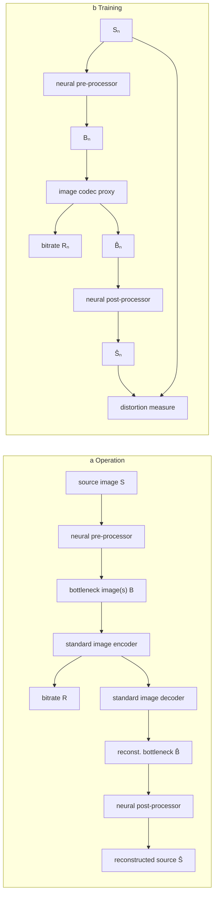
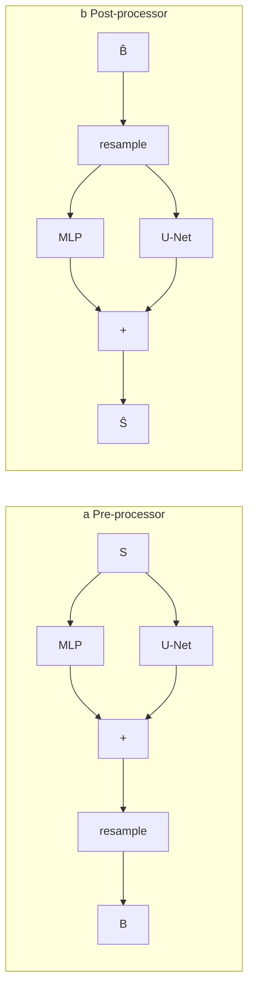
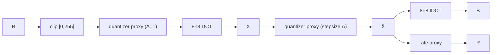
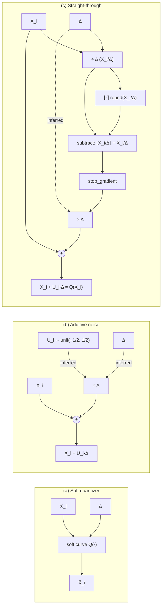

```mermaid
flowchart LR
%% t=0 (I-frame)
S0["Sₙ(0)"] --> Pre0["neural pre-processor"]
Pre0 --> B0["Bₙ(0)"]
B0 --> IC0["image codec proxy (Δ_intra)"]
IC0 --> R0["Rₙ(0)"]
IC0 --> LF0["loop filter proxy"]
LF0 --> Bhat0["B̂ₙ(0)"]
Bhat0 --> Post0["neural post-processor"]
Post0 --> Shat0["Ŝₙ(0)"]
S0 --> Dist0["distortion measure"]
Shat0 --> Dist0
Dist0 --> D0["Dₙ(0)"]

%% t=1 (P-frame)
S1["Sₙ(1)"] --> Pre1["neural pre-processor"]
Pre1 --> B1["Bₙ(1)"]
Bhat0 --> MC1["motion comp proxy"]
B1 --> IP1["intra/inter prediction proxy"]
MC1 --> IP1
IP1 --> Sub1((−))
B1 --> Sub1
Sub1 --> E1["Eₙ(1)"]
E1 --> IC1["image codec proxy (Δ_inter)"]
IC1 --> R1["Rₙ(1)"]
IC1 --> Ehat1["Êₙ(1)"]
Ehat1 --> Add1((+))
IP1 --> Add1
Add1 --> LF1["loop filter proxy"]
LF1 --> Bhat1["B̂ₙ(1)"]
Bhat1 --> Post1["neural post-processor"]
Post1 --> Shat1["Ŝₙ(1)"]
S1 --> Dist1["distortion measure"]
Shat1 --> Dist1
Dist1 --> D1["Dₙ(1)"]

%% t=2 (P-frame)
S2["Sₙ(2)"] --> Pre2["neural pre-processor"]
Pre2 --> B2["Bₙ(2)"]
Bhat1 --> MC2["motion comp proxy"]
B2 --> IP2["intra/inter prediction proxy"]
MC2 --> IP2
IP2 --> Sub2((−))
B2 --> Sub2
Sub2 --> E2["Eₙ(2)"]
E2 --> IC2["image codec proxy (Δ_inter)"]
IC2 --> R2["Rₙ(2)"]
IC2 --> Ehat2["Êₙ(2)"]
Ehat2 --> Add2((+))
IP2 --> Add2
Add2 --> LF2["loop filter proxy"]
LF2 --> Bhat2["B̂ₙ(2)"]
Bhat2 --> Post2["neural post-processor"]
Post2 --> Shat2["Ŝₙ(2)"]
S2 --> Dist2["distortion measure"]
Shat2 --> Dist2
Dist2 --> D2["Dₙ(2)"]
```

# Document Pack

## Corpus Metadata
- corpus_name: sandwiched_compression_guleryuz_2024
- creation_purpose: LLM extraction ground truth
- default_authority: authoritative_source unless otherwise noted per chunk
- extraction_method: verbatim extraction from PDF text layer with manual verification of formulas, figures, tables
- extraction_date: 2026-04-21
- global_notes: |
    Paper is "Sandwiched Compression: Repurposing Standard Codecs with Neural Network Wrappers" by Guleryuz, Chou, Isik, Hoppe, Tang, Du, Taylor, Davidson, Fanello. IEEE Transaction preprint version (arXiv:2402.05887v2, 20 Feb 2025). Contains main paper (Sec. I–VII, pages 1–13) plus Supplementary Material (Sec. VIII, pages 14–20 in submitted numbering; marked as pages 1–6 inside the supplementary). PDF text layer is mostly clean; minor CJK-like artifacts appear around math hats/tildes (e.g., S^ renders as "Sˆ", B^ as "Bˆ", x^ as "xˆ") — preserved in Formula Raw, normalized in Formula Verified. Page numbers below refer to the PDF page number (1–20), not the printed "IEEE TRANSACTION ON XXXX, 2024 N" footer numbering which restarts at 1 for supplementary. Formula equation numbers (1)–(3) are used in the main paper; (4)–(40) appear in supplementary Sec. VIII-A and VIII-B. Tables I and II are main-paper tables.

# Source: main_paper
- source_file: 2402_05887v2.pdf
- version_type: arxiv_preprint_v2
- venue: IEEE Transaction (submission; "IEEE TRANSACTION ON XXXX, 2024")
- year: 2024 (arXiv v2 dated Feb 2025)
- extraction_method: PDF text layer + visual verification
- notes_on_artifacts: |
    Two-column layout. Hat/tilde accents in Unicode appear as "Sˆ", "Bˆ", "Xˆ", "xˆ" (combining caret displayed after base char) in the raw text. Similarly "˜" after base glyphs and "′" for primes. Bullet separators and em-dashes are preserved. Formula Raw preserves these as-is; Formula Verified normalizes to LaTeX.

---

## Section
- source_file: 2402_05887v2.pdf
- version_type: arxiv_preprint_v2
- section_path: Title & Authors
- pages: 1
- chunk_id: sandw-main-pages-01-title-001
- content_type: verbatim
- authority_level: authoritative_source

### Verbatim
```text
Sandwiched Compression: Repurposing
Standard Codecs with Neural Network Wrappers

Onur G. Guleryuz, Philip A. Chou, Berivan Isik, Hugues Hoppe, Danhang Tang,
Ruofei Du, Jonathan Taylor, Philip Davidson, and Sean Fanello
```

---

## Section
- source_file: 2402_05887v2.pdf
- version_type: arxiv_preprint_v2
- section_path: Abstract
- pages: 1
- chunk_id: sandw-main-abstract-001
- content_type: verbatim
- authority_level: authoritative_source

### Verbatim
```text
Abstract—We propose sandwiching standard image and video codecs between pre- and post-processing neural networks. The networks are jointly trained through a differentiable codec proxy to minimize a given rate-distortion loss. This sandwich architecture not only improves the standard codec's performance on its intended content, but more importantly, adapts the codec to other types of image/video content and to other distortion measures. The sandwich learns to transmit "neural code images" that optimize and improve overall rate-distortion performance, with the improvements becoming significant especially when the overall problem is well outside of the scope of the codec's design. We apply the sandwich architecture to standard codecs with mismatched sources transporting different numbers of channels, higher resolution, higher dynamic range, computer graphics, and with perceptual distortion measures. The results demonstrate substantial improvements (up to 9 dB gains or up to 30% bitrate reductions) compared to alternative adaptations. We establish optimality properties for sandwiched compression and design differentiable codec proxies approximating current standard codecs. We further analyze model complexity, visual quality under perceptual metrics, as well as sandwich configurations that offer interesting potentials in video compression and streaming.

Index Terms—Image/video/computer-graphics compression, differentiable proxy, rate-distortion optimization, multi-spectral, super-resolution, high dynamic range, perceptual distortion
```

---

## Section
- source_file: 2402_05887v2.pdf
- version_type: arxiv_preprint_v2
- section_path: I. Introduction
- pages: 1-3
- chunk_id: sandw-main-sec1-intro-001
- content_type: verbatim
- authority_level: authoritative_source

### Verbatim
```text
Image and video compression are well-established domains, with a rich history marked by the evolution of standard codecs, such as JPEG, MPEG 1,2,4, H264/AVC, VC1, VP9, H265/HEVC, AV1, and H266/VVC [2]–[7]. These codecs are fundamentally rooted in linear transforms like the discrete cosine tranform (DCT) in the spatial dimensions, and motion-compensated prediction in the temporal dimension. Their designs and optimizations are typically guided by the analytically convenient mean-squared-error (MSE) metric albeit with eventual subjective quality verification.

Recent advancements have spotlighted learned image and video codecs based on neural networks trained end-to-end that are competitive with or outperform the standard codecs in rate-distortion metrics when distortion is measured through MSE [8]–[14]. In other scenarios where complete faith to the source is not demanded, more significant reductions in bitrate for the same visual quality have been obtained by training networks using auxiliary distortion measures (such as image likelihood modeled by discriminators in generative adversarial networks [15]). Neural networks have an obvious functional advantage over standard codecs in that they can be trained on datasets of images whose distributions are mismatched from the usual photographic images, for example medical, multispectral, depth, geometric, or other unusual image classes, as well as other distortion criteria, including human perceptual criteria but also machine performance criteria (e.g., classification, segmentation, labeling, and diagnosis.)

Unfortunately, the performance and functional advantages of neural codecs come at great computational cost [9], [11]–[14]. This cost is typically at a level that is impractical for HD imagery at video rates even on dedicated neural chips especially in mobile devices where power is a prime concern. Handling UHD at graphics rates is even more impractical. Capable networks require massive computational resources, power, and chip area. In-loop tandem GPU-CPU solutions where part of the CPU (GPU) compute is offloaded to the GPU (CPU) need massive bandwidth. As of this writing, even for next generation compression standards under development [16], these issues force neural tools to be limited to 1000 Multiply-Accumulate (MAC) networks. Competent neural models need hundreds of thousands to millions of MACs [17], [18]. A 1000 MAC model is understandably quite limited in comparison [19].

An interesting way of using neural networks is in the form of pre-post processors that function outside of the main compression loop [20]. Such designs do not suffer from bandwidth issues as CPU-GPU transfers are one-way and can be made optional, for example, only enabled for capable decoders with neural processing resources. As we show in this paper (see results with perceptual distortion measures later) one can even augment the standards-based compression chain with a single neural pre-processor and accomplish significant performance bumps while targeting standard decoders unaware/incapable of neural processing¹. Another advantage of the pre-post processors as proposed in this paper is their highly parallelizable nature, with parallelism easily exploited by, say, spatially tiling the picture over GPU slices to take already above-real-time performance to many hundreds if not thousands of frames-per-second [21]. In comparison, neural processing is typically limited to a few frames-per-second [18].

In this paper, we propose such a pre-post architecture as a hybrid between standard codecs and purely neural codecs, which we call the sandwich architecture². In the sandwich architecture, a standard codec is positioned between a neural pre-processor and a neural post-processor, which are jointly trained to minimize distortion subject to a bitrate constraint. The neural pre- and post-processors can be lightweight, yet they are able to improve the rate-distortion performance of the standard codec, even on typical color photographic images/video when the distortion measure is MSE. Much more interestingly, we show that the improvement is especially pronounced when the application mismatches the standard codec's design target in some way, including non-RGB images (e.g., C-channel images with C ≠ 3 such as medical, multispectral, depth, geometric, and other sensed images), non-MSE distortion criteria (e.g., human perceptual metrics, realism metrics, and machine task-specific performance metrics), and non-standard profile hardware constraints (e.g., higher bit depth and higher spatial resolution). At the same time, the sandwich approach leverages the standard codec for much of the heavy lifting, including highly efficient transforms, entropy coding, and motion processing. Vast resources have been put into the hardware implementations of standard codecs and their broader ecosystems (transparent packetization, networking, routing, etc.), which can make these resources essentially free compared to the power consumption required in neural chips.

As we illustrate in this paper, the magic behind the sandwich architecture is the ability for the pre-processor to learn how to produce images of neural codes that are well-compressible by a standard codec and for the post-processor to learn how to decode these images, to minimize the relevant distortion measure. Of course, the neural code images have to be robust to the compression noise typically inserted at those bitrates by the standard codec. To gain an intuitive understanding of what these neural code images may look like, consider a simplified problem in which the neural pre- and post-processors adapt a 1-channel (grayscale) codec to compressing an ordinary 3-channel color image, shown in Fig. 1. The top image (a) is the original source image fed into the pre-processor. The neural code image (b), or bottleneck image, is the image produced by the pre-processor and fed into the encoder of the standard codec. This is called the bottleneck image since it is at the locus of the compression bottleneck. Note that the bottleneck image contains spatial modulation patterns (akin to watermarks) that serve to encode the color information in this case. These patterns are the neural codes. The reconstructed bottleneck image (c) is emitted from decoder of the standard codec (note the typical JPEG blocking artifacts) and fed into the post-processor. The reconstructed source image (d) is the image output from the post-processor. Note that both color and sharp spatial definition are recovered from the neural codes³. Fig. 2 shows the analogue for video compression with HEVC. This time the processors use temporally coherent modulation patterns to communicate color. (Refer to subsections IV-A and VI-B for rate-distortion results relevant to these scenarios, and to VI-B for a discussion on neural codes' temporal coherence.)

Few works prior to ours paired standard codecs with neural networks as pre- or post-processors. Most paired the standard codec with either a neural pre-processor alone (e.g., to perform denoising of the input image [26]–[28]) or a neural post-processor alone (e.g., to perform deblocking or other enhancements of the output image [29]–[31]). A few works paired standard codecs with both neural pre- and post-processors, such as [20], [32]–[35], but these solutions, like prior non-neural solutions such as [36] did so in such a way that the pre- and post-processors may be used independently; thus no neural codes are generated; hence they do not take full advantage of the communication available between the pre- and post-processors (see Proposition 1 as to why this is critically important.)

Beyond proposing the sandwich architecture itself, a major contribution of our paper is a solution for jointly training the pre- and post-processors. To jointly train these neural networks using standard gradient back-propagation, the standard codec must be differentiable. Hence during training we replace the standard codec with a differentiable codec proxy. We show that well-designed simple proxies that approximate key codec components allow the training of models that robustly work with different standard codecs. Using these proxies we demonstrate the advantages of the sandwich architecture across a variety of image and video compression settings:

• For coding of 3-channel color images over a 1-channel (grayscale, or 4:0:0) codec, as in Fig. 1, sandwiching has 6–9 dB gain in MSE. Over a 1.5-channel (4:2:0) codec, sandwiching has a 10% reduction in bitrate. And over a 3-channel (4:4:4) codec, sandwiching has a 15% reduction in bitrate.
• For coding of 2x high resolution (HR) or super-resolved images over 1x lower resolution (LR) codecs, sandwiching has up to 9 dB gain in MSE.
• For coding of 16-bit high dynamic range⁴(HDR) color images over an 8-bit lower dynamic range (LDR) codec, sandwiching has up to 3 dB gain in MSE.
• For coding of 3-channel computer graphics normal maps over a 1.5-channel codec, sandwiching has a 4-5 dB gain in MSE. Over a 3-channel codec, sandwiching has a 1.5-2 dB gain, or about 15% reduction in bitrate.
• For coding of 8-channel computer graphics texture maps (3-channel albedo, 3-channel normals, 1-channel roughness, and 1-channel occlusion) over an 8-channel codec (implemented as the concatenation of eight 1-channel instances), sandwiching has a 20-30% reduction in bitrate, when distortion is measured over the final lighted, rendered images across multiple views. We term this measure the shaded distortion.
• For coding of video, we show analogous gains in MSE for coding color over grayscale codecs, and coding HR over LR codecs. Perhaps most importantly from the perspective of video applications, we demonstrate that for coding color video over color codecs, sandwiching yields 30% reduction in bitrate at the same visual quality, when trained to minimize the perceptual distortion measure LPIPS instead of MSE. We also provide related VMAF results.

Our results are geared toward establishing the following outline. In order to generate an intuitive understanding and to analyze the role of encoding with different sub-sampling patterns (4:4:4 v.s. 4:2:0 and so on) we start with image compression with a straightforward transform coder as embodied by the JPEG standard. We then demonstrate that the results do not depend heavily on whether the standard codec is JPEG or HEVC-Intra (HEIC) without any model retraining indicating the efficacy of our proxies. Our primary results are with HEVC as the codec-du-jour that immediately benefits from many re-purposing scenarios we look at. We also show that the results degrade but hold up well as the number of parameters of the pre- and post-processors is reduced by more than two orders of magnitude, i.e., a 99% reduction in parameters, in each neural processor. The main point we establish is the capacity of the sandwich in re-purposing the standard codec in various applications with very significant improvements. We nevertheless further point to work that successfully uses the sandwich for basic compression improvements with VVC/AV1 on HD/UHD video using very low complexity models.

The rest of the paper is organized as follows. The prelude of Section II discusses the optimal sandwich, mathematically framing our work within the rich pre-post-processor literature. Section III presents the sandwich architecture. Section IV includes image compression experiments followed by complexity results in Section V. Section VI is devoted to video compression experiments. Section VII concludes the paper.

Footnotes:
¹ Of course, as discussed in section II, even end-to-end, purpose-built, minimal-weight neural codecs can be augmented with a sandwich to re-purpose them to different content or distortion measures.
² Our early work appeared in [22]–[24].
³ The reader versed in watermarking and data-embedding [25] will note the similarities except that the processors in this case need not hide the embedded data. That the networks have to be jointly optimized is clear.
⁴ In this work, the term HDR is interchangeable with high-bit-depth.

Footnote on first page: "This work was done while the authors were at Google Research. The source code for this work can be found at [1]."
```

---

## Section
- source_file: 2402_05887v2.pdf
- version_type: arxiv_preprint_v2
- section_path: I. Introduction / Fig. 1
- pages: 1
- chunk_id: sandw-main-fig-1-cap-001
- content_type: figure_caption
- authority_level: authoritative_source

### Caption
```text
Fig. 1. The sandwich architecture can accomplish surprising results even with a simple codec (here JPEG 4:0:0, a single-channel grayscale codec). The neural pre-processor is able to encode the full RGB image in (a) into a grayscale image of neural codes in (b). The neural codes are low-frequency dither-like patterns that modulate the color information yet also survive JPEG compression (c). At the decoding end, the neural post-processor demodulates the patterns to faithfully recover the color while also achieving deblocking. The interested reader can generate an extensive set of further examples using our software at [1].
```

---

## Section
- source_file: 2402_05887v2.pdf
- version_type: arxiv_preprint_v2
- section_path: I. Introduction / Fig. 1
- pages: 1
- chunk_id: sandw-main-figdesc-1-001
- content_type: figure_description
- authority_level: interpretive_overlay
- description_scope: visible_content_only

### Figure Type
```text
image_grid
```

### Panel Structure
```text
2x2 grid of photographs, each with a sub-caption below the image. Panel labels: (a), (b), (c), (d).
```

### Visual Description
```text
(a) Top-left: A full-color RGB photograph showing red chili peppers hanging among green leaves on a plant. Bright saturated colors visible.
(b) Top-right: A grayscale version of the same scene, but overlaid with dither-like fine modulation patterns. The peppers and leaves are rendered as varying shades of gray with visible high-frequency noise-like textures. This is the bottleneck / neural code image.
(c) Bottom-left: A grayscale image similar to (b) but now showing JPEG blocking artifacts (visible 8x8 block structure in smoother regions); modulation patterns are still present but partially degraded.
(d) Bottom-right: A reconstructed full-color image that visually resembles (a), with color successfully recovered including the red peppers and green foliage.
```

### Embedded Text
```text
(a) Original source image
(b) Bottleneck (neural code) image
(c) Reconstructed bottleneck image
(d) Reconstructed source image
```

---

## Section
- source_file: 2402_05887v2.pdf
- version_type: arxiv_preprint_v2
- section_path: I. Introduction / Fig. 2
- pages: 2
- chunk_id: sandw-main-fig-2-cap-001
- content_type: figure_caption
- authority_level: authoritative_source

### Caption
```text
Fig. 2. Analogue of Fig. 1 for video and HEVC. The sandwich is used to transport full color video over a gray-scale codec (HEVC 4:0:0). First, fifth, and tenth frames of compressed bottlenecks, final reconstructions by the post-processor, and original source videos are shown. Rate=0.07 bpp, PSNR=36.0 dB. The sandwich establishes temporally coherent modulation-like patterns on the bottlenecks through which the pre-processor encodes color that are then demodulated by the post-processor for a full-color result. The patterns are spatially broader compared to those in Fig. 1 to facilitate more efficient motion compensation. The interested reader can generate an extensive set of further examples using our software at [1].
```

---

## Section
- source_file: 2402_05887v2.pdf
- version_type: arxiv_preprint_v2
- section_path: I. Introduction / Fig. 2
- pages: 2
- chunk_id: sandw-main-figdesc-2-001
- content_type: figure_description
- authority_level: interpretive_overlay
- description_scope: visible_content_only

### Figure Type
```text
image_grid
```

### Panel Structure
```text
3x3 grid of video frames. Rows correspond to three different frames (first, fifth, tenth frames per caption). Columns appear to show different variants (bottleneck / reconstruction / original, per caption).
```

### Visual Description
```text
The 3x3 grid shows a person's face (male subject, beard, darker clothing) across three time points. The left/center columns appear in grayscale with visible broader-spatial-scale modulation patterns (wider than those in Fig. 1). The rightmost images appear in full color showing the reconstructed/original scene. The patterns move coherently with the subject between frames.
```

### Embedded Text
```text
[no embedded panel text visible within the figure itself beyond the outer caption]
```

---

## Section
- source_file: 2402_05887v2.pdf
- version_type: arxiv_preprint_v2
- section_path: II. Prelude: The Sandwich as a Codelength Constrained Vector Quantizer
- pages: 3
- chunk_id: sandw-main-sec2-prelude-001
- content_type: verbatim
- authority_level: authoritative_source

### Verbatim
```text
Pre-Post processing applied around a compression codec is a well-known technique. In ΣΔ compression [37] one wraps a simple 1-bit quantizer to make it function like a k-bit one, in [38] one wraps DPCM codecs (performance-wise inferior to transform codecs) to get them to perform like transform codecs, using [26]–[31] one can wrap image/video codecs to reduce input noise, reduce codec artifacts, and so on. Compression literature includes many such interesting designs that offer specific solutions to specific problems. With neural networks one now has the capability of designing much more general mappings as pre-post processors. In this section we briefly explore the potential gains one can tap into.

Compression codecs can be seen as vector quantizer codebooks. A standard codec at a particular operating point can be thought of in terms of a set of codewords (decoder reconstruction vectors existing in high dimensions) and associated binary strings (bits signaling each desired reconstruction). A sandwich with non-identity wrappers maps a source to use the standard codebook and then maps the standard decoder's output into final reconstructions. Looking from outside the sandwich, we hence see a new codebook for the source that is determined by the pre/post-processor mappings modifying the standard codebook. Suppose the standard codec is not adequate for a given source. Then, a natural question to ask is "How much better can we make the standard codec by wrapping it in a sandwich?"

In order to quantify the properties of "sandwich-achievable" codebooks and how they would compare to a codebook that is optimal for the source, let us momentarily disregard limitations on neural network complexity and limitations of back propagation in finding overall optimal solutions. Assume we can find the optimal pre-post-processor mappings. What is the efficiency of the sandwich system with respect to an optimal codebook? The following proposition shows that the optimal sandwich can accomplish the optimal compression performance except for a potential rate penalty induced by a mismatch to the standard codec's codelengths.
```

---

## Section
- source_file: 2402_05887v2.pdf
- version_type: arxiv_preprint_v2
- section_path: II. Prelude / Proposition 1
- pages: 3-4
- chunk_id: sandw-main-sec2-prop1-001
- content_type: verbatim
- authority_level: authoritative_source

### Verbatim
```text
Proposition 1. [Optimal Sandwich] Let X be a Rⁿ-valued bounded source, let d be a distortion measure, and let D(R) be the operational distortion-rate function for X under d. For any ε > 0, let (α*, β*, γ*) be the encoding, decoding, and lossless coding maps for a rate-R codec for X achieving D(R) within ε/2. Let (α, β, γ) be a regular codec (e.g., a standard codec, possibly designed for a different source and different distortion measure) with bounded codelengths. Then there exist neural pre- and post-processors f and g such that the codec sandwich (α ∘ f, g ∘ β, γ) has expected distortion at most D(R) + ε and expected rate at most R + D(p||q) + ε, where p(k) = P({α*(X) = k}) and q(k) = 2^(−|γ(k)|).

Proof. See subsection VIII-A in Supplementary Material. □
```

---

## Section
- source_file: 2402_05887v2.pdf
- version_type: arxiv_preprint_v2
- section_path: II. Prelude (post-Proposition 1)
- pages: 4
- chunk_id: sandw-main-sec2-prelude-002
- content_type: verbatim
- authority_level: authoritative_source

### Verbatim
```text
Note the key role of the sandwich in repurposing the inner codebook to the outer compression scenario. When sandwiching a high-performance image/video codec for different but related image/video applications one can expect the mismatch to be lighter compared to, say, when one tries to sandwich an image codec to transport audio data. From the perspective of the proposition, using configurable codecs, i.e., those that allow codebook codelengths to be optimized, may help minimize the implied penalty. While beyond the scope of this paper, we point to generalizing the sandwich to configurable codecs as an interesting research direction.
```

---

## Section
- source_file: 2402_05887v2.pdf
- version_type: arxiv_preprint_v2
- section_path: III. The Sandwich Architecture / A. Sandwich for Image Compression
- pages: 4
- chunk_id: sandw-main-sec3a-imgcomp-001
- content_type: verbatim
- authority_level: authoritative_source

### Verbatim
```text
The sandwich architecture for image compression is shown in Fig. 3(a). An original source image S with one or more full-resolution channels is mapped by a neural pre-processor into one or more channels of neural (or latent) codes. Each channel of neural codes may be full resolution or reduced resolution. The channels of neural codes are grouped into one or more bottleneck images B suitable for consumption by a standard image codec. The bottleneck images are compressed by the standard image encoder into a bitstream, which is decompressed by the corresponding decoder into reconstructed bottleneck images B̂. The channels of the reconstructed bottleneck images are then mapped by a neural post-processor into a reconstructed source image Ŝ.

The standard image codec in the sandwich is configured to avoid any color conversion or further subsampling. Thus, it compresses three full-resolution channels as an image in 4:4:4 format, one full-resolution channel and two half-resolution channels as an image in 4:2:0 format, or one full-resolution channel as an image in 4:0:0 (i.e., grayscale) format — all without color conversion. Other combinations of channels are processed by appropriate grouping.

Fig. 4 shows the network architectures we use for our neural pre-processor and post-processor. The upper branch of the network learns pointwise operations, like color conversion, using a multilayer perceptron (MLP) or equivalently a series of 1×1 2D convolutional layers, while the lower branch uses a U-Net [39] to take into account more complex spatial context. At the output of the pre-processor, any half-resolution channels are obtained by sub-sampling, while at the input of the post-processor, any half-resolution channels are first upsampled to full resolution. We have deliberately picked the U-Net as it is a well-known model whose performance in various areas is well-documented. U-Nets have also been systematically studied with reduced parameter/complexity variants easily generated.

Fig. 3(b) shows the setup for training the neural pre-processor and post-processor using stochastic gradient descent. Because derivatives cannot be back-propagated through the standard image codec, it is replaced by a differentiable⁵ image codec proxy. For each training example n = 1, ..., N, the image codec proxy reads the bottleneck image Bₙ and outputs the reconstructed bottleneck image B̂ₙ, as a standard image codec would. It also outputs a real-valued estimate of the number of bits Rₙ that the standard image codec would use to encode Bₙ. The distortion is measured as any differentiable distortion measure Dₙ = d(Sₙ, Ŝₙ) (such as the squared ℓ₂ error ||Sₙ − Ŝₙ||²) between the original and reconstructed source images. Together, the rate Rₙ and distortion Dₙ are the key elements of the differentiable loss function. Specifically, the neural pre-processor and post-processor are optimized to minimize the Lagrangian D + λR of the average distortion D = (1/N) Σₙ Dₙ and the average rate R = (1/N) Σₙ Rₙ.

The image codec proxy itself comprises the differentiable elements shown in Fig. 5. For convenience the image codec proxy is modeled after JPEG, an early codec for natural images. Nevertheless, experimental results show that it induces the trained pre-processor and post-processor to produce bottleneck images sufficiently like natural images that they can also be compressed efficiently by other codecs such as HEVC (or VVC/AV1, see [40].) The image codec proxy spatially partitions the input channels into 8 × 8 blocks. In the DCT domain, the blocks X = [Xᵢ] are processed independently, using (1) a "differentiable quantizer" (or quantizer proxy) to create distorted DCT coefficients X̂ᵢ = Q(Xᵢ), and (2) a differentiable entropy measure (or rate proxy) to estimate the bitrate required to represent the distorted coefficients X̂ᵢ. Both proxies take the nominal quantization stepsize Δ as an additional input. Further information on quantizer and rate proxies is provided in supplementary section VIII-B, their adaptations for HR and HDR are provided in VIII-D.

Footnote 5: In this paper as in most of the ML literature, the term differentiable more properly means almost-everywhere differentiable.
```

---

## Section
- source_file: 2402_05887v2.pdf
- version_type: arxiv_preprint_v2
- section_path: III. Architecture / Fig. 3
- pages: 4
- chunk_id: sandw-main-fig-3-cap-001
- content_type: figure_caption
- authority_level: authoritative_source

### Caption
```text
Fig. 3. Neural-sandwiched image codec during (a) operation and (b) training. Gray boxes are not differentiable; blue are differentiable; green are trainable. Loss function for training is Σ Dₙ + λRₙ over example images n.
```

---

## Section
- source_file: 2402_05887v2.pdf
- version_type: arxiv_preprint_v2
- section_path: III. Architecture / Fig. 3
- pages: 4
- chunk_id: sandw-main-figdesc-3-001
- content_type: figure_description
- authority_level: interpretive_overlay
- description_scope: visible_content_only

### Figure Type
```text
architecture_diagram
```

### Panel Structure
```text
Two sub-panels stacked/arranged vertically: (a) Operation, (b) Training.
```

### Visual Description
```text
(a) Operation panel: Left-to-right flow starting from "source image S", through "neural pre-processor" (green, trainable) producing "bottleneck image(s) B", into "standard image encoder" (gray, not differentiable) emitting "bitrate R", then "standard image decoder" (gray) producing "reconst. bottleneck image(s) B̂", through "neural post-processor" (green), producing "reconstructed source Ŝ".

(b) Training panel: Same overall left-to-right structure but the standard encoder+decoder pair is replaced by a single "image codec proxy" block (blue, differentiable) that takes Bₙ in and outputs B̂ₙ plus "bitrate Rₙ". The original Sₙ and reconstructed Ŝₙ both feed into a "distortion measure" block (blue, differentiable). Loss combines distortion and bitrate Rₙ.
```

### Embedded Text
```text
source image
bottleneck image(s)
reconst. bottleneck image(s)
reconstructed source
bitrate R
S, B, B̂, Ŝ
Sₙ, Bₙ, B̂ₙ, Ŝₙ
bitrate Rₙ
standard image encoder
standard image decoder
neural pre-processor
neural post-processor
image codec proxy
distortion measure
(a) Operation
(b) Training
```

---

## Section
- source_file: 2402_05887v2.pdf
- version_type: arxiv_preprint_v2
- section_path: III. Architecture / Fig. 3
- pages: 4
- chunk_id: sandw-main-flow-3-001
- content_type: flowchart
- authority_level: interpretive_overlay
- diagram_confidence: high

### Diagram Type
```text
training_framework (with operation/inference sub-diagram)
```

### Nodes
```text
# Panel (a) Operation:
A1: source image S
A2: neural pre-processor  [green: trainable]
A3: bottleneck image(s) B
A4: standard image encoder  [gray: not differentiable]
A5: bitrate R
A6: standard image decoder  [gray: not differentiable]
A7: reconst. bottleneck image(s) B̂
A8: neural post-processor  [green: trainable]
A9: reconstructed source Ŝ

# Panel (b) Training:
B1: Sₙ (source)
B2: neural pre-processor  [green: trainable]
B3: Bₙ (bottleneck)
B4: image codec proxy  [blue: differentiable]
B5: bitrate Rₙ
B6: B̂ₙ (reconstructed bottleneck)
B7: neural post-processor  [green: trainable]
B8: Ŝₙ (reconstructed source)
B9: distortion measure  [blue: differentiable]
```

### Edges
```text
# Panel (a):
A1 -> A2
A2 -> A3
A3 -> A4
A4 -> A5
A4 -> A6
A6 -> A7
A7 -> A8
A8 -> A9

# Panel (b):
B1 -> B2
B2 -> B3
B3 -> B4
B4 -> B5
B4 -> B6
B6 -> B7
B7 -> B8
B1 -> B9
B8 -> B9
```

### Diagram Annotations
```text
Color coding legend (from caption):
- Gray boxes: not differentiable
- Blue boxes: differentiable
- Green boxes: trainable
Loss function: Σ Dₙ + λRₙ over example images n.
```

### Flow Description
```text
Panel (a) depicts the inference-time deployment: the neural pre-processor maps source S to bottleneck B, which is compressed by a non-differentiable standard encoder/decoder pair into B̂, then decoded by the neural post-processor into Ŝ. Panel (b) depicts the training-time setup: the non-differentiable standard codec is replaced by the differentiable image codec proxy that simultaneously emits a reconstructed bottleneck B̂ₙ and a differentiable rate estimate Rₙ. Both Sₙ and Ŝₙ feed into the distortion measure. The overall training loss is D + λR (Lagrangian). The pre-processor and post-processor (green) are the only trainable modules.
```

### Mermaid


---

## Section
- source_file: 2402_05887v2.pdf
- version_type: arxiv_preprint_v2
- section_path: III. Architecture / Fig. 4
- pages: 4
- chunk_id: sandw-main-fig-4-cap-001
- content_type: figure_caption
- authority_level: authoritative_source

### Caption
```text
Fig. 4. Neural pre-processor and post-processor.
```

---

## Section
- source_file: 2402_05887v2.pdf
- version_type: arxiv_preprint_v2
- section_path: III. Architecture / Fig. 4
- pages: 4
- chunk_id: sandw-main-flow-4-001
- content_type: flowchart
- authority_level: interpretive_overlay
- diagram_confidence: high

### Diagram Type
```text
architecture_diagram
```

### Nodes
```text
# Panel (a) Pre-processor:
P1: S (input)
P2: MLP (upper branch)
P3: U-Net (lower branch)
P4: + (sum)
P5: resample
P6: B (output)

# Panel (b) Post-processor:
Q1: B̂ (input)
Q2: resample
Q3: MLP (upper branch)
Q4: U-Net (lower branch)
Q5: + (sum)
Q6: Ŝ (output)
```

### Edges
```text
# Panel (a):
P1 -> P2
P1 -> P3
P2 -> P4
P3 -> P4
P4 -> P5
P5 -> P6

# Panel (b):
Q1 -> Q2
Q2 -> Q3
Q2 -> Q4
Q3 -> Q5
Q4 -> Q5
Q5 -> Q6
```

### Diagram Annotations
```text
A1: Upper branch is the pointwise MLP (equivalent to 1x1 2D convolutions, learns operations like color conversion).
A2: Lower branch is the U-Net, capturing spatial context.
A3: "resample" denotes subsampling at the pre-processor output (for half-resolution channels) and upsampling at the post-processor input (bringing half-resolution back to full resolution), per body text of Sec. III-A.
```

### Flow Description
```text
Both pre-processor and post-processor share a two-branch additive structure: a pointwise MLP branch in parallel with a U-Net branch, whose outputs are summed before (pre-processor) or after (post-processor) an explicit resample block. In the pre-processor, the input S feeds both branches; the summed result is resampled and emitted as bottleneck B. In the post-processor, input B̂ is first resampled (upsampled for half-res channels), then fed into both branches; the summed result is emitted as Ŝ.
```

### Mermaid


---

## Section
- source_file: 2402_05887v2.pdf
- version_type: arxiv_preprint_v2
- section_path: III. Architecture / Fig. 5
- pages: 4
- chunk_id: sandw-main-fig-5-cap-001
- content_type: figure_caption
- authority_level: authoritative_source

### Caption
```text
Fig. 5. Image codec proxy.
```

---

## Section
- source_file: 2402_05887v2.pdf
- version_type: arxiv_preprint_v2
- section_path: III. Architecture / Fig. 5
- pages: 4
- chunk_id: sandw-main-flow-5-001
- content_type: flowchart
- authority_level: interpretive_overlay
- diagram_confidence: high

### Diagram Type
```text
architecture_diagram (image codec proxy)
```

### Nodes
```text
C1: B (input bottleneck image)
C2: clip [0, 255]
C3: quantizer proxy (1st occurrence, stepsize 1)
C4: 8×8 DCT
C5: X (DCT coefficients)
C6: quantizer proxy (2nd occurrence, stepsize Δ)
C7: X̂ (quantized DCT coefficients)
C8: 8×8 IDCT
C9: B̂ (output reconstructed bottleneck)
C10: rate proxy
C11: R (rate output)
```

### Edges
```text
C1 -> C2
C2 -> C3
C3 -> C4
C4 -> C5
C5 -> C6
C6 -> C7
C7 -> C8
C8 -> C9
C7 -> C10
C10 -> C11
```

### Diagram Annotations
```text
A1: First quantizer proxy uses stepsize = 1 (per figure annotation "stepsize 1").
A2: Second quantizer proxy uses stepsize Δ (the nominal JPEG quantization stepsize).
A3: The rate proxy reads quantized DCT coefficients X̂ and the stepsize Δ to produce R.
A4: Quantizer proxies accept Δ as an input to allow gradient flow to Δ.
```

### Flow Description
```text
The image codec proxy (JPEG-shaped) processes bottleneck image B by first clipping to [0,255], applying a quantizer proxy with stepsize 1 (integer-level quantization at the pixel domain), computing 8×8 DCT to get coefficients X, applying a second quantizer proxy with stepsize Δ in the DCT domain to get X̂, applying the inverse 8×8 DCT to recover B̂. A rate proxy consumes X̂ (and Δ) to emit a differentiable estimate R of the JPEG bitrate. This whole path is differentiable end-to-end.
```

### Mermaid


---

## Section
- source_file: 2402_05887v2.pdf
- version_type: arxiv_preprint_v2
- section_path: III. The Sandwich Architecture / B. Sandwich for Video Compression
- pages: 5
- chunk_id: sandw-main-sec3b-vidcomp-001
- content_type: verbatim
- authority_level: authoritative_source

### Verbatim
```text
The sandwich architecture for video compression is shown wrapping our video codec proxy in Fig. 6. Observe that the neural pre-post-processors handle video frames independently enabling straightforward spatio-temporal parallelization. The video codec proxy maps an input video sequence to an output video sequence plus a bitrate for each video frame. It has the following components.

Intra-Frame Compression. The video codec proxy simulates coding the first (t = 0) frame of the group, or the I-frame, using the image codec proxy described above in subsection III-A.

Motion Compensation. The video codec proxy simulates predicting each subsequent (t > 0) frame of the group, or P-frame, by motion-compensating the previous frame. Motion compensation is performed using a pre-computed dense motion flow field obtained by running a state-of-the-art optical flow estimator, UFlow [41], between the original source images Sₙ(t) and Sₙ(t − 1). The video proxy simply applies this motion flow to the previous reconstructed bottleneck image B̂ₙ(t−1) to obtain an inter-frame prediction B̃ₙ(t) for bottleneck image Bₙ(t). Note that our motion compensation proxy does not actually depend on Bₙ(t), so even though it is a spatial warping, it is a linear map from B̂ₙ(t − 1) to B̃ₙ(t), with a constant Jacobian. This makes optimization much easier than using a differentiable function of both B̂ₙ(t − 1) and Bₙ(t) that finds as well as applies a warping from B̂ₙ(t−1) to Bₙ(t). Such functions have notoriously fluctuating Jacobians that make training difficult.

Prediction Mode Selection. An Intra/Inter prediction proxy simulates a modern video codec's Inter/Intra prediction mode decisions. This ensures better handling of temporally occluded/uncovered regions in video. First, Intra prediction is simulated by rudimentarily compressing the current-frame and low pass filtering it. This simulates filtering, albeit not the usual directional filtering, to predict each block from its neighboring blocks. Initial rudimentary compression ensures that the Intra prediction proxy is not unduly preferred at very low rates. For each block, the Intra prediction (from spatial filtering) is compared to the Inter prediction (from motion compensation), and the one closest to the input block determines the mode of the prediction.

Residual Compression. The predicted image, comprising a combination of Intra- and Inter-predicted blocks, is subtracted from the bottleneck image, to form a prediction residual. The residual image is then compressed using the image codec proxy described above in subsection III-A. The compressed residual is added back to the prediction to obtain a "pre-loop-filtered" reconstruction of the bottleneck image B̃ₙ(t).

Loop Filtering. The "pre-loop-filtered" reconstruction is then filtered by a loop filter to obtain the final reconstructed bottleneck image B̂ₙ(t). The loop filter is implemented with a small U-Net((8);(8, 8)) [39] (see Section V for U-Net notation) that processes one channel at a time. The loop filter is trained once for four rate points on natural video using only the video codec proxy with rate-distortion training loss in order to mimic common loop filters. The resulting set of filters are kept fixed for all of our simulations, i.e., once independently trained, the four loop filters are not further trained.

Pre-Post-Processors. Same as subsection III-A and Fig. 4.

Loss Function. The loss function is the total rate-distortion Lagrangian Σ_{n,t} Dₙ(t) + λRₙ(t), where Dₙ(t) and Rₙ(t) are the distortion and rate of frame t in clip n. The rate term serves to encourage the pre- and post-processors to produce temporally consistent neural codes, since neural codes that move according to the motion field are well predicted (see subsection VI-B.) Note that the overall mapping from the input images through the pre-processor, video codec proxy, post-processor, and loss function is differentiable.
```

---

## Section
- source_file: 2402_05887v2.pdf
- version_type: arxiv_preprint_v2
- section_path: III. Architecture / Fig. 6
- pages: 5
- chunk_id: sandw-main-fig-6-cap-001
- content_type: figure_caption
- authority_level: authoritative_source

### Caption
```text
Fig. 6. Neural-sandwiched video codec during training. Loss function for training is Σ Dₙ(t) + λRₙ(t) over example clips n and frames t. The shaded box (video codec proxy) is replaced with a standard video codec during operation/inference. Green boxes are trainable; blue are differentiable; cyan are differentiable with pre-trained parameters. The entire video codec proxy is differentiable.
```

---

## Section
- source_file: 2402_05887v2.pdf
- version_type: arxiv_preprint_v2
- section_path: III. Architecture / Fig. 6
- pages: 5
- chunk_id: sandw-main-flow-6-001
- content_type: flowchart
- authority_level: interpretive_overlay
- diagram_confidence: high

### Diagram Type
```text
training_framework (video codec proxy)
```

### Nodes
```text
# Common modules (replicated per frame, one instance shown):
N1: Sₙ(t) — input frame at time t
N2: neural pre-processor  [green: trainable]
N3: Bₙ(t) — bottleneck at time t
N4: image codec proxy  [blue: differentiable, inside video codec proxy box]
N5: loop filter proxy  [cyan: differentiable with pre-trained parameters]
N6: motion comp proxy  [blue: differentiable]
N7: intra/inter prediction proxy  [blue: differentiable]
N8: B̂ₙ(t) — reconstructed bottleneck at time t
N9: neural post-processor  [green: trainable]
N10: Ŝₙ(t) — reconstructed frame at time t
N11: distortion measure  [blue: differentiable]
N12: Dₙ(t) — per-frame distortion
N13: Rₙ(t) — per-frame rate
N14: Eₙ(t) — residual at time t (t>0)
N15: Êₙ(t) — reconstructed residual (t>0)
N16: + (residual adder, t>0)
N17: − (subtractor producing residual, t>0)

# Time-step specific annotations:
- t = 0 (I-frame path): no motion comp or intra/inter prediction used; N3 goes directly into N4.
- t ≥ 1 (P-frame path): intra/inter prediction proxy + motion comp proxy produce a prediction that is subtracted from N3 to form N14, then image codec proxy compresses N14 to Êₙ(t), which is added back via N16 and goes through loop filter proxy to produce N8.
- Stepsize Δ_intra is used for the I-frame image codec proxy; Δ_inter for subsequent P-frames.
```

### Edges
```text
# t = 0 (I-frame), pathway:
Sₙ(0) -> pre-processor -> Bₙ(0) -> image_codec_proxy (Δ_intra) -> B̃_intermediate -> loop_filter_proxy -> B̂ₙ(0) -> post-processor -> Ŝₙ(0) -> distortion -> Dₙ(0)
image_codec_proxy -> Rₙ(0)

# t >= 1 (P-frame), pathway:
Sₙ(t) -> pre-processor -> Bₙ(t) -> subtract -> Eₙ(t) -> image_codec_proxy (Δ_inter) -> Êₙ(t) -> add -> pre-loop-filter reconstruction -> loop_filter_proxy -> B̂ₙ(t) -> post-processor -> Ŝₙ(t) -> distortion -> Dₙ(t)
image_codec_proxy -> Rₙ(t)

# Prediction feed-in:
B̂ₙ(t-1) -> motion_comp_proxy -> (candidate P-prediction)
Bₙ(t) -> intra/inter_prediction_proxy (using both Intra candidate and Inter candidate from motion_comp) -> prediction image
prediction image -> subtract (against Bₙ(t))
prediction image -> add (back to Êₙ(t))

# Temporal dependency (explicit):
B̂ₙ(t-1) -> motion_comp_proxy  [explicit recurrent / cross-frame link]
```

### Diagram Annotations
```text
A1: Legend (from caption): Green=trainable, Blue=differentiable, Cyan=differentiable with pre-trained parameters. The shaded outer "video codec proxy" box contains image_codec_proxy, loop_filter_proxy, motion_comp_proxy, intra/inter_prediction_proxy.
A2: Loss = Σ_{n,t} Dₙ(t) + λ Rₙ(t), summed over clips n and frames t.
A3: Stepsize Δ_intra for the I-frame image codec proxy; Δ_inter for the residual-coding image codec proxy at each P-frame.
A4: Same neural pre-processor and post-processor (green) is shared across all frames.
A5: At inference, the entire "video codec proxy" is replaced by a real standard video codec.
A6: UFlow-derived motion flow is pre-computed between Sₙ(t) and Sₙ(t-1) and applied to B̂ₙ(t-1) (not B̂ₙ(t)) — gives a constant-Jacobian linear map.
```

### Flow Description
```text
The figure shows three consecutive frame pipelines stacked vertically (t = 0, 1, 2). For t = 0 (top), the frame Sₙ(0) is pre-processed to Bₙ(0), encoded by the image codec proxy with stepsize Δ_intra, passed through the loop filter proxy to produce B̂ₙ(0), then post-processed to Ŝₙ(0) and scored against Sₙ(0) via the distortion measure (producing Dₙ(0)); the proxy also emits Rₙ(0). For t ≥ 1, the previous reconstructed bottleneck B̂ₙ(t-1) feeds into the motion compensation proxy; together with the intra/inter prediction proxy it produces a prediction that is subtracted from Bₙ(t), yielding a residual Eₙ(t). The residual is coded by the image codec proxy (stepsize Δ_inter), reconstructed as Êₙ(t), added back to the prediction, loop-filtered, and post-processed to produce Ŝₙ(t). Pre-processor and post-processor are shared (same weights) across all frames. Motion flow is pre-computed with UFlow. Loop filter has pre-trained U-Net((8);(8,8)) weights kept fixed. Total loss sums distortion+λ·rate across all (n,t).
```

### Mermaid


---

## Section
- source_file: 2402_05887v2.pdf
- version_type: arxiv_preprint_v2
- section_path: IV. Image Compression Experiments / preamble
- pages: 5-6
- chunk_id: sandw-main-sec4-preamble-001
- content_type: verbatim
- authority_level: authoritative_source

### Verbatim
```text
We first present results for compressing ordinary 3-channel color (RGB) images through codecs with a restricted number of channels (4:0:0 and 4:2:0 compared to 4:4:4), where distortion is measured as RGB-PSNR. Then we present results for compressing high spatial resolution (HR) images through codecs with lower spatial resolution (LR), and for compressing high dynamic range (HDR) images through codecs with lower dynamic range (LDR), where distortion is again measured as RGB-PSNR. These results are indicative of how a neural sandwich can adapt the hardware of a standard codec to source images with higher resource requirements. Finally, we present results on graphics data, first for compressing 3-channel normal maps, where distortion is measured as PSNR on the normal maps, and then for compressing 8-channel shading maps for use in computer graphics, where distortion is measured as RGB-PSNR after shading from 8 to 3 channels and across a multitude of views. These results are indicative of how a neural sandwich can adapt a codec designed for 3-channel RGB images and MSE to other image types and other distortion measures. In these results, we also see how the codec proxy, though modeled after JPEG, is also adequate to represent more advanced codecs such as HEIC/HEVC-Intra.

For our RGB results, we use the Pets, CLIC, and HDR+ datasets [42]–[44], while for our computer graphics results, we use the Relightables dataset [45]. Training and evaluation are performed on distinct subsets of each dataset. All results are generated using actual compression on 500 test images of size 256 × 256 randomly cropped from the evaluation subset.

The U-Nets have a multi-resolution ladder of four with channels doubling up the ladder from 32 to 512, specifically U-Net([32, 64, 128, 256]; [512, 256, 128, 64, 32]). (See Section V for notation.) MLP networks have two layers with 16 nodes. Output channels of the networks are determined based on bottleneck and overall output channels.

We obtain R-D curves as follows. We train four models mᵢ, i = 1, ..., 4, for four different Lagrange multiplier values λᵢ using established D + λR optimization [46]. For each model, we obtain an R-D curve by encoding the images using a sweep over many step-size values. Finally we compute the Pareto frontier of these four curves.
```

---

## Section
- source_file: 2402_05887v2.pdf
- version_type: arxiv_preprint_v2
- section_path: IV.A Compressing RGB Images with C ≤ 3-channel Codecs
- pages: 6
- chunk_id: sandw-main-sec4a-rgb-001
- content_type: verbatim
- authority_level: authoritative_source

### Verbatim
```text
In this section, we report the rate-distortion performance of compressing 3-channel RGB images with JPEG YUV and neural-sandwiched JPEG codecs, across 4:4:4, 4:2:0, and 4:0:0 formats, which respectively correspond to C-channel bottleneck images with C = 3, 1.5, and 1.

Fig. 7 shows R-D results evaluated on the Pets dataset. For the 4:0:0 format, the neural-sandwiched version shows 6–9 dB improvement over the standard codec, due to the fact that for this format, the standard codec can transport only grayscale, whereas the neural-sandwiched version manages to transport color through modulating patterns, as exemplified in Fig. 1. For the 4:2:0 and 4:4:4 formats, R-D performances for the standard codec are close to one another. For both formats, the neural-sandwiched standard codec performs better than the standard codec in either format. In particular, for the 4:2:0 format, the neural-sandwiched version shows a 10% reduction in bitrate, while for the 4:4:4 format, the neural-sandwiched version shows a 15% reduction. It is interesting to see that, unlike the case for the standard codec, that the neural-sandwiched version finds a way to utilize the denser sampling of the 4:4:4 format for improved gains over 4:2:0. Also surprising is that at low rates the neural-sandwiched 4:0:0 codec becomes competitive with the standard codecs.
```

---

## Section
- source_file: 2402_05887v2.pdf
- version_type: arxiv_preprint_v2
- section_path: IV.A / Fig. 7
- pages: 6
- chunk_id: sandw-main-fig-7-cap-001
- content_type: figure_caption
- authority_level: authoritative_source

### Caption
```text
Fig. 7. R-D performance of compressing 3-channel RGB images with JPEG YUV and neural-sandwiched JPEG, in 4:4:4, 4:2:0, and 4:0:0.
```

---

## Section
- source_file: 2402_05887v2.pdf
- version_type: arxiv_preprint_v2
- section_path: IV.A / Fig. 7
- pages: 6
- chunk_id: sandw-main-figdesc-7-001
- content_type: figure_description
- authority_level: interpretive_overlay
- description_scope: visible_content_only
- data_recoverability: not_recoverable

### Figure Type
```text
line_chart
```

### Panel Structure
```text
Single panel. X-axis: Rate (bpp), range 0.4 to 0.9. Y-axis: RGB-PSNR (dB), range 20 to 35.
```

### Visual Description
```text
Six curves plotted on a single panel. The three sandwiched variants (solid lines, colored) sit clearly above the three baseline JPEG YUV variants (dashed lines) across the plotted range. Within each family, 4:4:4 sits above 4:2:0 which sits above 4:0:0 for the baseline, while the sandwiched 4:4:4 and 4:2:0 curves are close to each other (sandwiched 4:4:4 slightly higher) and the sandwiched 4:0:0 curve is lowest among the sandwiched family but at low rates approaches the baseline 4:4:4/4:2:0 curves (per paper body text).
```

### Embedded Text
```text
Axis labels:
- Rate (bpp)
- RGB-PSNR (dB)

Legend entries:
- neural-sandwiched JPEG 4:4:4
- neural-sandwiched JPEG 4:2:0
- neural-sandwiched JPEG 4:0:0
- JPEG YUV 4:4:4
- JPEG YUV 4:2:0
- JPEG YUV 4:0:0
```

---

## Section
- source_file: 2402_05887v2.pdf
- version_type: arxiv_preprint_v2
- section_path: IV.B Compressing High Resolution (HR) RGB Images with Lower Resolution (LR) Codecs
- pages: 6-7
- chunk_id: sandw-main-sec4b-hr-001
- content_type: verbatim
- authority_level: authoritative_source

### Verbatim
```text
In this subsection, we consider the rate-distortion performance of compressing high resolution (HR) RGB images with lower resolution (LR) standard codecs, both with JPEG and HEIC. We also contrast results with "CNN-RD" [33]. LR is half the horizontal and vertical resolution of HR. Thus, whether sandwiched or not, we precede the standard codecs with bicubic filtering and 2× downsampling and follow them with 2× upsampling using Lanczos3 interpolation.

Fig. 8 shows R-D results using (a) JPEG and (b) HEIC as the standard codec evaluated on the CLIC dataset. When they are neural-sandwiched, JPEG and HEIC have identical pre- and post-processors, with no retraining for HEIC. The neural-sandwiched standard codecs show substantial improvement over the standard codecs alone: 5-7 dB gains for JPEG, and 7-8 dB gains for HEIC, in the 0.3-0.5 bpp range, and further gains at higher rates. We also compare a standard codec with a post-processor alone (i.e., with no pre-processor), where the post-processor is architecturally identical to the post-processor in the neural sandwich, but trained to perform only super-resolution. It can be seen that the post-processor alone accounts for at most 2 dB of the sandwich's gains. The substantial improvement obtained by the sandwich over the super-resolution network clearly points to the importance of the neural pre-processor, the joint training of the pre- and post-processor networks, and their ability to communicate with each other using neural codes to signal how to super-resolve the images. For reference, the figure also shows R-D performances of compressing HR RGB images with codecs that are natively HR. It can be seen that the sandwiched LR codecs outperform even the native HR codecs over a wide range of lower bitrates. Comparing JPEG and HEIC results, it can be seen that the gains due to neural sandwiching one are substantially retained for the other.

Fig. 9 shows examples that are instructive in understanding the advantages of the sandwich over post-processing alone. Observe the substantial improvements obtained by the sandwiched codec over JPEG and neural post-processing: Detail is retained in the city view, aliasing is avoided on the building face and the texture, and text is visible on the keyboard. All with substantial dB improvements (+4.5 dB, +6.5 dB, +4.5 dB over neural post-processing) at the same rate. Interestingly note the very patterned and noisy looking bottlenecks as depicted in Fig. S2 in supplementary subsection VIII-C.

Table I compares our HR sandwich to the closely related but independently developed work of "CNN-RD" [33], which also surrounds a standard codec with neural pre- and post-processors using 2x down- and up-sampling. However their networks' formulation and training regimen prohibits them from learning to communicate the neural codes needed to carry good HR information. (Their post-processor is trained first to super-resolve a low-pass image; then their pre-processor is trained to minimize D + λR with the fixed post-processor. This misses the main advantage of having neural pre- and post-processors.) The table shows that our work has significantly higher gains in PSNR-Y (dB) relative to the same standard codec (JPEG) on the Div2k validation image 0873 [47]. Indeed, though not shown in the table, their solution saturates and begins to under-perform the standard codec above 0.8 bpp (~30 dB); ours out-performs the standard codec until about 2.0 bpp (~37 dB).
```

---

## Section
- source_file: 2402_05887v2.pdf
- version_type: arxiv_preprint_v2
- section_path: IV.B / Fig. 8
- pages: 6
- chunk_id: sandw-main-fig-8-cap-001
- content_type: figure_caption
- authority_level: authoritative_source

### Caption
```text
Fig. 8. R-D performances of compressing high resolution (HR) RGB images with lower resolution (LR) codecs alone, LR codecs plus neural post-processing, and neural-sandwiched SR codecs. For reference, also shown are R-D performances of compressing HR RGB images with HR codecs.
```

---

## Section
- source_file: 2402_05887v2.pdf
- version_type: arxiv_preprint_v2
- section_path: IV.B / Fig. 8
- pages: 6
- chunk_id: sandw-main-figdesc-8-001
- content_type: figure_description
- authority_level: interpretive_overlay
- description_scope: visible_content_only
- data_recoverability: not_recoverable

### Figure Type
```text
line_chart
```

### Panel Structure
```text
Two side-by-side panels. (a) JPEG, (b) HEIC. Both panels share X-axis Rate (bpp) and Y-axis RGB-PSNR (dB). Panel (a) X ranges 0.2–0.9, Y ranges 25–42. Panel (b) X ranges 0.1–0.9, Y ranges 25–42.
```

### Visual Description
```text
In each panel four curves are plotted:
1. A solid red curve labeled "neural-sandwiched [codec] 4:4:4 LR" — the top curve at low-to-mid bitrates, climbing steeply.
2. A solid magenta/pink curve labeled "neural-sandwiched [codec] (post-only) 4:4:4 LR" — below the sandwich curve, modest improvement.
3. A dashed red curve labeled "[codec] 4:4:4 LR" — baseline LR codec, lowest curve, saturates.
4. A dashed blue curve labeled "[codec] 4:4:4 HR" — native HR codec, strong at higher bitrates, crosses above sandwich at high rates.
Sandwich outperforms both baseline LR and LR+post-only across the plotted ranges, and even outperforms native HR over lower bitrates per paper text.
```

### Embedded Text
```text
Axis labels:
- Rate (bpp)
- RGB-PSNR (dB)

Panel labels: (a) JPEG, (b) HEIC

Legend entries (Panel a):
- neural-sandwiched JPEG 4:4:4 LR
- neural-sandwiched JPEG (post-only) 4:4:4 LR
- JPEG 4:4:4 LR
- JPEG 4:4:4 HR

Legend entries (Panel b):
- neural-sandwiched HEIC 4:4:4 LR
- neural-sandwiched HEIC (post-only) 4:4:4 LR
- HEIC 4:4:4 LR
- HEIC 4:4:4 HR
```

---

## Section
- source_file: 2402_05887v2.pdf
- version_type: arxiv_preprint_v2
- section_path: IV.B / Table I
- pages: 7
- chunk_id: sandw-main-table-1-001
- content_type: table
- authority_level: authoritative_source

### Verbatim
```text
bpp      | 0.2  | 0.3  | 0.4  | 0.5  | 0.6  | 0.7  | 0.8
CNN-RD [33] | 1.58 | 1.09 | 0.67 | 0.55 | 0.33 | 0.18 | 0.15
HR sandwich | 1.59 | 1.49 | 1.42 | 1.49 | 1.49 | 1.46 | 1.69

TABLE I
GAIN IN PSNR-Y (DB) OVER JPEG ON DIV2K VALIDATION IMAGE 0873.
```

### Structured Table
```csv
bpp,CNN-RD_gain_dB,HR_sandwich_gain_dB
0.2,1.58,1.59
0.3,1.09,1.49
0.4,0.67,1.42
0.5,0.55,1.49
0.6,0.33,1.49
0.7,0.18,1.46
0.8,0.15,1.69
```

Notes:
- Values are PSNR-Y gain in dB over JPEG baseline, measured on DIV2K validation image 0873.
- authority_level for Structured Table: verified_reconstruction.

---

## Section
- source_file: 2402_05887v2.pdf
- version_type: arxiv_preprint_v2
- section_path: IV.B / Fig. 9
- pages: 7
- chunk_id: sandw-main-fig-9-cap-001
- content_type: figure_caption
- authority_level: authoritative_source

### Caption
```text
Fig. 9. Super-resolution sandwich of a low-res codec: Original 256 × 256 source images and reconstructions by sandwich, JPEG with linear upsampling, and JPEG with neural post-processing respectively. The regions identified in the top row show areas where detail is either lost or aliased after downsampling and LR transport. Note how the sandwich output in (b) correctly transports the detail whereas JPEG and post-only recover the wrong information. The picture in the last column, while correctly transported by the sandwich, results in severe aliasing for JPEG and even further reduced performance for post-only which amplifies the aliasing. The interested reader can generate an extensive set of further examples using our software at [1].
```

---

## Section
- source_file: 2402_05887v2.pdf
- version_type: arxiv_preprint_v2
- section_path: IV.B / Fig. 9
- pages: 7
- chunk_id: sandw-main-figdesc-9-001
- content_type: figure_description
- authority_level: interpretive_overlay
- description_scope: visible_content_only

### Figure Type
```text
qualitative_comparison
```

### Panel Structure
```text
4 rows × 3 columns grid of images. Rows: (a) Originals, (b) Sandwich, (c) JPEG, (d) Post-Only. Columns: three different scenes (a cityscape at night, a high-rise building facade, and a close-up of green computer keyboard keys).
```

### Visual Description
```text
Row (a) Originals: three source images — night cityscape with illuminated buildings, a tall building facade, and a keyboard with green keys and small numeric/character labels.
Row (b) Sandwich: reconstructions preserve fine detail (lights in the cityscape, textured building facade, readable keyboard characters).
Row (c) JPEG: reconstructions show loss of detail, aliasing artifacts on the building facade, and blurred/lost small characters on the keyboard.
Row (d) Post-Only: reconstructions show further-degraded detail, aliasing is amplified on the building, and keyboard characters are still illegible.
Red rectangular region markers overlay the top-row originals to indicate regions of interest.
```

### Embedded Text
```text
(a) Originals
(b) Sandwich: (29.1 dB, 0.54 bpp), (32.1 dB, 0.33 bpp), (35.1 dB, 0.38 bpp)
(c) JPEG: (23.4 dB, 0.54 bpp), (23.9 dB, 0.34 bpp), (26.6 dB, 0.38 bpp)
(d) Post-Only: (24.6 dB, 0.54 bpp), (25.6 dB, 0.34 bpp), (30.6 dB, 0.38 bpp)
```

---

## Section
- source_file: 2402_05887v2.pdf
- version_type: arxiv_preprint_v2
- section_path: IV.C Compressing HDR RGB Images with LDR Codecs
- pages: 7-8
- chunk_id: sandw-main-sec4c-hdr-001
- content_type: verbatim
- authority_level: authoritative_source

### Verbatim
```text
In this subsection, we report the rate-distortion performance of compressing high dynamic range (HDR) RGB images with lower dynamic range (LDR) standard codecs (8-bit JPEG and 8-bit HEIC), alone, neural-sandwiched, and compared to Dequantization-Net [48]. For the HDR simulations, we use the HDR+ dataset [44]. The HDR images have d = 16 bits per color component, while the LDR codecs transmit only 8 bits per color component. By sandwiching the LDR codecs in a sandwich, it is possible to signal spatially-localized tone mapping curves via neural codes from the pre-processor to the post-processor, in order to carry the least significant bits of the HDR image through the LDR codec.

Fig. 10 shows R-D results in terms of d-bit RGB-PSNR vs. bits per pixel, evaluated on the HDR+ dataset. The d-bit RGB-PSNR is given by

[Equation (1)]

where S and Ŝ are the original and reproduced d-bit RGB source images of size H × W. The figure shows the performance of the LDR codecs alone (8-bit JPEG and 8-bit HEIC) in comparison to the neural-sandwiched LDR codecs, as well as to JPEG post-processed with the state-of-the-art Dequantization-Net [48] (trained on the same dataset). The maximum PSNR one can obtain by losslessly encoding the most significant 8-bits is illustrated as LDR saturation. The standard codecs alone, or with the Dequantization-Net post-processor only, saturate at that level. Observe that the sandwiched codecs rise up to 3 dB above the saturation line, highlighting the importance of joint training of the pre- and post-processors and communication between them using neural codes. Unfortunately the software implementing the standard codecs precludes the transmission of higher rates. Neither our JPEG nor HEIC implementation is able to go beyond ~3 bpp on average. For all R-D curves the highest rate point is where the software cuts off. Using codec implementations accomplishing higher rates, the gains of the sandwich are expected to increase further.
```

---

## Section
- source_file: 2402_05887v2.pdf
- version_type: arxiv_preprint_v2
- section_path: IV.C / Equation (1) d-bit RGB-PSNR
- pages: 7
- chunk_id: sandw-main-eq-1-001
- content_type: formula
- authority_level: verified_reconstruction
- normalization_confidence: high

### Formula Raw
```text
10 log10 (
  (2^d − 1)^2 (3HW) / ‖S − Sˆ‖^2
),   (1)
```

### Formula Verified
```latex
10 \log_{10}\!\left(\frac{(2^{d} - 1)^{2}\,(3HW)}{\bigl\lVert S - \hat{S}\bigr\rVert^{2}}\right) \qquad (1)
```

Notes: Numerator uses squared peak value times pixel count 3HW (3 color channels × H × W pixels). Denominator is squared ℓ₂ error between original d-bit RGB image S and reproduced Ŝ.

---

## Section
- source_file: 2402_05887v2.pdf
- version_type: arxiv_preprint_v2
- section_path: IV.C / Fig. 10
- pages: 8
- chunk_id: sandw-main-fig-10-cap-001
- content_type: figure_caption
- authority_level: authoritative_source

### Caption
```text
Fig. 10. R-D performances of compressing HDR images with LDR, neural-sandwiched, and Dequantization-Net [48] codecs.
```

---

## Section
- source_file: 2402_05887v2.pdf
- version_type: arxiv_preprint_v2
- section_path: IV.C / Fig. 10
- pages: 8
- chunk_id: sandw-main-figdesc-10-001
- content_type: figure_description
- authority_level: interpretive_overlay
- description_scope: visible_content_only
- data_recoverability: not_recoverable

### Figure Type
```text
line_chart
```

### Panel Structure
```text
Single panel. X-axis: Rate (bpp) range 0.5–3.5. Y-axis: RGB-PSNR (dB) range 44–62. A horizontal reference line for "LDR saturation" is drawn across the plot.
```

### Visual Description
```text
Five elements plotted:
1. "neural-sandwiched JPEG 4:4:4 LDR" (solid blue) — rises clearly above the LDR saturation line, reaching ~3 dB above it at the highest plotted rates.
2. "neural-sandwiched HEIC 4:4:4 LDR" (solid black) — also rises above saturation, tracks close to sandwiched JPEG.
3. "JPEG 4:4:4 LDR" (dashed red) — saturates at the LDR saturation level.
4. "HEIC 4:4:4 LDR" (dashed black) — saturates at the LDR saturation level.
5. "JPEG 4:4:4 LDR + DequantizationNet" (dashed green/magenta) — also saturates at the LDR saturation level.
All R-D curves have their highest-rate data point at approximately the codec cutoff (~3 bpp).
```

### Embedded Text
```text
Axis labels:
- Rate (bpp)
- RGB-PSNR (dB)

Legend entries:
- neural-sandwiched JPEG 4:4:4 LDR
- neural-sandwiched HEIC 4:4:4 LDR
- JPEG 4:4:4 LDR
- HEIC 4:4:4 LDR
- LDR saturation
- JPEG 4:4:4 LDR + DequantizationNet
```

---

## Section
- source_file: 2402_05887v2.pdf
- version_type: arxiv_preprint_v2
- section_path: IV.D Compressing 3-channel Normal Maps with Color Codecs
- pages: 8
- chunk_id: sandw-main-sec4d-normals-001
- content_type: verbatim
- authority_level: authoritative_source

### Verbatim
```text
Many computer graphics applications periodically transport normal maps to GPUs in compressed form to decompress and accomplish sophisticated lighting effects that increase the perceived resolution of a mesh [49], [50]. An example normal map is shown in Fig. 13 (b). Each pixel stores a unit-norm vector n = (nₓ, n_y, n_z) representing the tangent-space normal (n_z ≥ 0) with respect to a mesh. Note that three channels are redundant since nₓ² + n_y² + n_z² = 1. To represent these as 8-bit images, each channel [−1, 1] is mapped to RGB [0, 255].

Fig. 11 show R-D results using HEIC evaluated on normal maps from the Relightables dataset [45]. The best results are obtained with the neural-sandwiched 4:4:4 codecs, which exploit the channel redundancy. Neural-sandwiching codecs provide significant gains over their respective baselines. YUV 4:2:0 and YUV 4:4:4 codecs use RGB-YUV conversion, which does not provide any advantage for this dataset. Codecs with 4:4:4 (no color conv.) are better. The best non-neural result (custom) is obtained by zeroing out the third component n_z during compression, and recovering it in a postprocess as n̂_z = 1 − (n̂ₓ² + n̂_y²)^(1/2). However, the best result overall (by more than 1 dB) uses a neural-sandwiched codec with a 4:4:4 format. Comparing HEIC results to the JPEG case (see Fig. S3 for JPEG), it can again be seen that the gains due to neural sandwiching of JPEG are substantially retained for HEIC, with about 15% reduction in bitrate compared to HEIC alone.
```

---

## Section
- source_file: 2402_05887v2.pdf
- version_type: arxiv_preprint_v2
- section_path: IV.D / Fig. 11
- pages: 8
- chunk_id: sandw-main-fig-11-cap-001
- content_type: figure_caption
- authority_level: authoritative_source

### Caption
```text
Fig. 11. R-D performances of compressing normal map images with HEIC and neural-sandwiched HEIC, in various formats.
```

---

## Section
- source_file: 2402_05887v2.pdf
- version_type: arxiv_preprint_v2
- section_path: IV.D / Fig. 11
- pages: 8
- chunk_id: sandw-main-figdesc-11-001
- content_type: figure_description
- authority_level: interpretive_overlay
- description_scope: visible_content_only
- data_recoverability: not_recoverable

### Figure Type
```text
line_chart
```

### Panel Structure
```text
Single panel. X-axis: Rate (bpp), range 0.3–0.9. Y-axis: PSNR (dB), range 28–40.
```

### Visual Description
```text
Seven curves plotted. The neural-sandwiched variants (solid lines, three curves for 4:4:4 / 4:2:0 / 4:0:0) sit above the respective non-sandwiched HEIC baselines. The best-performing curve is neural-sandwiched HEIC 4:4:4 (solid blue, top). The "HEIC custom" (zero-out n_z) variant sits between the sandwich family and the regular HEIC 4:4:4 (RGB) / (YUV) variants. HEIC 4:2:0 (YUV) is the lowest.
```

### Embedded Text
```text
Axis labels:
- Rate (bpp)
- PSNR (dB)

Legend entries:
- neural-sandwiched HEIC 4:4:4
- neural-sandwiched HEIC 4:2:0
- neural-sandwiched HEIC 4:0:0
- HEIC custom
- HEIC 4:4:4 (RGB)
- HEIC 4:4:4 (YUV)
- HEIC 4:2:0 (YUV)
```

---

## Section
- source_file: 2402_05887v2.pdf
- version_type: arxiv_preprint_v2
- section_path: IV.E Compressing Computer Graphics having 8-channel Texture Maps with 3-channel Color Codecs and Shaded Distortion
- pages: 8-9
- chunk_id: sandw-main-sec4e-texture-001
- content_type: verbatim
- authority_level: authoritative_source

### Verbatim
```text
A common technique in computer graphics is to render a surface using texture mapping, which stores sampled surface properties in an associated texture atlas image (see Fig. 13). Texture maps comprise large graphics assets and are repeatedly sent to the GPU in compressed form as rendered scenes vary. The texture map often contains not just albedo (RGB color) but additional surface properties (e.g., surface normals, roughness, ambient occlusion) that enable more realistic shading. In many graphics applications texture assets are compressed with standard codecs and transported prior to final rendering. In this section, we report rate-distortion performance of compressing 8-channel texture maps with and without sandwiching.

We briefly review the rendering process. To render a surface mesh from a particular view and with particular lighting, rasterization identifies the screen-space pixels covered by the mesh triangles. For each pixel, it obtains the interpolated 3D surface position as well as interpolated texture coordinates. Then, a pixel shader computes the view direction, the light direction(s), and the sampled texture attributes for the surface point. The final shaded RGB color for the pixel is a complicated formula involving all of these inputs.

For compression in this scenario, it is natural to measure distortion not over the texture image values but over the final rendered pixel colors. Specifically, we measure the average RGB MSE of images rendered using a collection of typical views and lighting conditions. We call this shaded distortion.

In principle, it should be possible to train the neural sandwich end-to-end by measuring shaded distortion over rendered images using a differentiable renderer. However, this proves challenging for the large texture map sizes (up to 4K) encountered in practice. Instead, we adopt a novel approach and measure shaded distortion in the domain of the texture images. That is, we compute shading using all the 3D parameters of the traditional rendering, but output the resulting shaded colors onto an image defined over the texture domain itself (see Fig. 13e). The key benefit is that the computation is local, so training can use cropped texture images. (For final evaluation, we measure shaded distortion over traditionally rendered images.)

In our experiments, we use a texture map with C = 8 channels: 3 RGB albedo channels, 3 normal map channels, 1 roughness channel, and 1 occlusion channel, as illustrated in Fig. 13. We refer to this as a [3, 3, 1, 1]-channel texture map.

Fig. 12 shows R-D results in terms of PSNR of the shaded distortion in dB vs bits per texture map pixel. Compression with and without neural sandwiching are compared. Without sandwiching, to compress the 8-channel texture map with a standard codec, we partition the texture map into its natural components, here with [3, 3, 1, 1] channels, and compress each component separately (with one codec using 4:4:4 format and color conversion, one codec using 4:4:4 format and no color conversion, and two codecs using 4:0:0 format). With sandwiching, to compress the 8-channel texture map, for concreteness we choose 8-channel bottleneck images at the same resolution as the texture map, and code each of the 8 bottleneck channels as a grayscale image using HEIC 4:0:0. It can be seen from the figure that neural-sandwiching provides a 20-30% reduction in bitrate compared to HEIC alone. Clearly, neural sandwiching can be used for non-RGB images with C > 3 channels and non-standard distortion measures.
```

---

## Section
- source_file: 2402_05887v2.pdf
- version_type: arxiv_preprint_v2
- section_path: IV.E / Fig. 12
- pages: 8
- chunk_id: sandw-main-fig-12-cap-001
- content_type: figure_caption
- authority_level: authoritative_source

### Caption
```text
Fig. 12. R-D performance of compressing 8-channel texture map images with standard codec alone and neural-sandwiched.
```

---

## Section
- source_file: 2402_05887v2.pdf
- version_type: arxiv_preprint_v2
- section_path: IV.E / Fig. 12
- pages: 8
- chunk_id: sandw-main-figdesc-12-001
- content_type: figure_description
- authority_level: interpretive_overlay
- description_scope: visible_content_only
- data_recoverability: not_recoverable

### Figure Type
```text
line_chart
```

### Panel Structure
```text
Single panel. X-axis: Rate (bpp), range 0–0.9. Y-axis: Shaded-Distortion-PSNR (dB), range 32–40.
```

### Visual Description
```text
Two curves:
1. "neural-sandwiched split-channel HEIC" (solid red) — the upper curve, clearly above the baseline across the full range; gap visibly increases at higher rates.
2. "[3, split]-channel HEIC" (dashed red) — the lower baseline curve.
```

### Embedded Text
```text
Axis labels:
- Rate (bpp)
- Shaded-Distortion-PSNR (dB)

Legend entries:
- neural-sandwiched split-channel HEIC
- [3, split]-channel HEIC
```

---

## Section
- source_file: 2402_05887v2.pdf
- version_type: arxiv_preprint_v2
- section_path: IV.E / Fig. 13
- pages: 8
- chunk_id: sandw-main-fig-13-cap-001
- content_type: figure_caption
- authority_level: authoritative_source

### Caption
```text
Fig. 13. Components of 8-channel texture map and samples of images rendered to measure shaded distortion.
```

---

## Section
- source_file: 2402_05887v2.pdf
- version_type: arxiv_preprint_v2
- section_path: IV.E / Fig. 13
- pages: 8
- chunk_id: sandw-main-figdesc-13-001
- content_type: figure_description
- authority_level: interpretive_overlay
- description_scope: visible_content_only

### Figure Type
```text
image_grid
```

### Panel Structure
```text
Five panels: (a), (b), (c), (d) arranged in a 2×2 grid at the top; (e) shows three rendered images in a row below.
```

### Visual Description
```text
(a) 3-channel albedo — a full-color texture atlas showing a human subject's skin tones and clothing; colors are natural.
(b) 3-channel normals — a false-color texture encoding surface normals with vivid rainbow-like hues (red, green, blue channels each tracking a normal component).
(c) 1-channel roughness — a grayscale texture map with varying brightness corresponding to surface roughness values.
(d) 1-channel occlusion — a grayscale texture map showing ambient-occlusion shadowing on concave regions.
(e) Three rendered images using different viewpoints and lights — dark-ambient scenes showing a human figure illuminated from different angles with physically plausible shading.
```

### Embedded Text
```text
(a) 3-channel albedo
(b) 3-channel normals
(c) 1-channel roughness
(d) 1-channel occlusion
(e) Shaded using different viewpoints and lights
```

---

## Section
- source_file: 2402_05887v2.pdf
- version_type: arxiv_preprint_v2
- section_path: V. Model Complexity
- pages: 9
- chunk_id: sandw-main-sec5-complexity-001
- content_type: verbatim
- authority_level: authoritative_source

### Verbatim
```text
In the image compression experiments of Section IV, we use an MLP in parallel with a U-Net. The MLP is relatively simple, with two hidden layers, each with 16 hidden channels. Most of the complexity is in the U-Net, which in its standard form [39] has four 2-layer 3×3 convolutional "encoder" blocks each followed by a 2× downsampling, followed by five 2-layer 3 × 3 convolutional "decoder" blocks separated by 2× upsampling and concatenation with the output of the same-resolution encoder block. The number of channels output from the encoder blocks is [32, 64, 128, 256], while the number of channels output from the decoder blocks is [512, 256, 128, 64, 32], denoted U-Net([32, 64, 128, 256]; [512, 256, 128, 64, 32]). A final 3 × 3 convolutional layer produces C_out output channels. These tuples, along with C_in and C_out, can be used as hyper-parameters to specify the U-Net. Table II illustrates the parameter and MAC-based complexity details of the U-Net family explored in this paper. Run-times in frames-per-second over a single GPU slice are also shown. These run-times can be directly scaled up with multiple slices by spatially tiling the target frames.

In this section, we study the trade-off between the complexity of the sandwich and its rate-distortion performance in compressing HR RGB images with LR codecs, as detailed in subsection IV-B. Fig. 14 shows R-D results for the HR-LR application, for neural sandwiches with different complexities, assuming the pre- and post-processors have equal complexity. While our default U-Net([32, 64, 128, 256]; [512, 256, 128, 64, 32]) has almost 8M parameters, many other U-Nets have many fewer parameters. For example, U-Net([32, 64]; [128, 64, 32]), which has reduced encoder and decoder blocks, two and three respectively, has only 491K parameters, a mere 6% of the parameters of the default U-Net, with less than 0.5 dB loss in R-D performance. In contrast, reducing complexity by reducing the number of channels, e.g., U-Net([16, 32, 64, 128]; [256, 128, 64, 32, 16]), has a less desirable trade-off.

As illustrated, massive reductions in the number of parameters are possible with little loss in performance especially with U-Net([32]; [32, 32]) having about 57K parameters, i.e., less than 1% of the parameters of the default U-Net. In the next section, on video experiments, we show that U-Net([32]; [32, 32]), which we call our slim network, likewise offers orders of magnitude reduction in parameters with little loss in R-D performance and significantly higher fps. Of course, optimizing the hyper-parameters, such as the number of layers or the convolutional filter size, considering asymmetric models, using depth-separable convolutions, etc., can significantly improve complexity further. Alternative model architectures, which are more efficient in terms of MACs, are explored in [40].
```

---

## Section
- source_file: 2402_05887v2.pdf
- version_type: arxiv_preprint_v2
- section_path: V. Model Complexity / Fig. 14
- pages: 9
- chunk_id: sandw-main-fig-14-cap-001
- content_type: figure_caption
- authority_level: authoritative_source

### Caption
```text
Fig. 14. R-D performance of compressing HR RGB images using LR codecs, with neural sandwiches of different complexity. Legend shows parameter counts (for pre-and-post-processor combined) for different U-Nets.
```

---

## Section
- source_file: 2402_05887v2.pdf
- version_type: arxiv_preprint_v2
- section_path: V. Model Complexity / Fig. 14
- pages: 9
- chunk_id: sandw-main-figdesc-14-001
- content_type: figure_description
- authority_level: interpretive_overlay
- description_scope: visible_content_only
- data_recoverability: not_recoverable

### Figure Type
```text
line_chart
```

### Panel Structure
```text
Single panel. X-axis: Rate (bpp) range 0.1–0.9. Y-axis: RGB-PSNR (dB) range 25–46.
```

### Visual Description
```text
Multiple curves corresponding to different U-Net sizes, plus HEVC 4:4:4 LR (dashed red) and HEVC 4:4:4 HR (dashed blue) reference curves, plus a "postonly" curve. The full-size sandwich (1.6e+07 params, 100%) is at the top. As parameter count decreases (down to 6.0e+04 / 0.4%), the R-D curves shift down modestly. Even the smallest models are clearly above the HEVC 4:4:4 LR baseline. The HEVC 4:4:4 HR reference crosses the sandwich curves at high rates.
```

### Embedded Text
```text
Axis labels:
- Rate (bpp)
- RGB-PSNR (dB)

Legend entries (each lists parameter count in scientific notation, percentage of full model, encoder tuple & decoder tuple):
- 1.6e+07 (100.0%) [32, 64, 128, 256] & [512, 256, 128, 64, 32]
- 9.5e+05 (6.0%) [32, 64] & [128, 64, 32]
- 3.9e+06 (25.0%) [16, 32, 64, 128] & [256, 128, 64, 32, 16]
- 2.4e+05 (1.5%) [16, 32] & [64, 32, 16]
- 9.8e+05 (6.3%) [8, 16, 32, 64] & [128, 64, 32, 16, 8]
- 6.0e+04 (0.4%) [8, 16] & [32, 16, 8]
- postonly (50.0%)
- HEVC 4:4:4 LR
- HEVC 4:4:4 HR
```

---

## Section
- source_file: 2402_05887v2.pdf
- version_type: arxiv_preprint_v2
- section_path: V. Model Complexity / Table II
- pages: 9
- chunk_id: sandw-main-table-2-001
- content_type: table
- authority_level: authoritative_source

### Verbatim
```text
U-Net hyperparameters                                    | Number of  | MACs        | FPS
encoder              | decoder                           | parameters | per-pixel   |
[32, 64, 128, 256]   | [512, 256, 128, 64, 32]           | 7847491    | 213943      | 71
[32, 64]             | [128, 64, 32]                     | 472387     | 112531      | 96
[16, 32, 64, 128]    | [256, 128, 64, 32, 16]            | 1963043    | 53981       | 145
[16, 32]             | [64, 32, 16]                      | 118691     | 28619       | 192
[8, 16, 32, 64]      | [128, 64, 32, 16, 8]              | 491347     | 13743       | 238
[8, 16]              | [32, 16, 8]                       | 29971      | 7399        | 323
[32]                 | [32, 32]                          | 57219      | 43347       | 244

TABLE II
U-NET COMPLEXITY FOR VARIOUS HYPERPARAMETERS.
FIXED HYPERPARAMETERS INCLUDE C_in = C_out = 3,
FILTERS SIZE = 3 × 3, AND LAYERS PER BLOCK = 2.
FRAMES-PER-SECOND (FPS) IS MEASURED FOR AN RGB FRAME
(1024 × 1024) ON A SINGLE CLOUD A100 SLICE [21].
```

### Structured Table
```csv
encoder,decoder,parameters,macs_per_pixel,fps
"[32, 64, 128, 256]","[512, 256, 128, 64, 32]",7847491,213943,71
"[32, 64]","[128, 64, 32]",472387,112531,96
"[16, 32, 64, 128]","[256, 128, 64, 32, 16]",1963043,53981,145
"[16, 32]","[64, 32, 16]",118691,28619,192
"[8, 16, 32, 64]","[128, 64, 32, 16, 8]",491347,13743,238
"[8, 16]","[32, 16, 8]",29971,7399,323
"[32]","[32, 32]",57219,43347,244
```

Notes:
- Fixed hyperparameters: C_in = C_out = 3, filter size = 3×3, layers per block = 2.
- FPS measured for a 1024×1024 RGB frame on a single Cloud A100 slice.
- authority_level for Structured Table: verified_reconstruction.
- Row 7 ([32]; [32, 32]) is the "slim" network referenced in the text; body text says ~57K parameters (≈ table value 57219).
- Note: body text claims U-Net([32, 64]; [128, 64, 32]) has "only 491K parameters", but the corresponding row in the table lists 472387 (~472K). There is a small discrepancy between body text ("491K") and table ("472387"); the row entry 491347 belongs to a different configuration [8, 16, 32, 64]; [128, 64, 32, 16, 8]. Preserving both verbatim.

---

## Section
- source_file: 2402_05887v2.pdf
- version_type: arxiv_preprint_v2
- section_path: VI.A Codec Setup and Dataset
- pages: 9-10
- chunk_id: sandw-main-sec6a-setup-001
- content_type: verbatim
- authority_level: authoritative_source

### Verbatim
```text
We generated a video dataset that consists of 10-frame clips of YUV video sequences from the AOM Common Test Conditions [51] and their associated motion flows, calculated using UFlow [41]. We use a batch size of 8, i.e., 8 video clips in each batch. Each clip is processed during the dataset generation step such that it has 10 frames of size 256x256, selected from video of fps 20-40. HEVC is implemented using x265 (IPP.., single reference frame, rdoq and loop filter on.) within ffmpeg.⁶ For each considered scenario, the model is trained for 1000 epochs, with a learning rate of 1e⁻⁴, and tested on 120 test video clips. RD plots are generated similar to Section IV. We report results in terms of YUV PSNR when using the ℓ₂ norm and "LPIPS (RGB) PSNR" when using LPIPS (refer to subsection VI-E for LPIPS particulars.)

Footnote 6: Observe that the rate for each clip thus reflects (i) an I-frame amortized over 10 frames and (ii) container format metadata though we tried to minimize the latter. The reader used to video rates where these two factors are amortized over hundreds of frames should expect higher reported rate numbers per-pixel.
```

---

## Section
- source_file: 2402_05887v2.pdf
- version_type: arxiv_preprint_v2
- section_path: VI.B Compressing RGB Video with Grayscale Codecs
- pages: 10
- chunk_id: sandw-main-sec6b-rgb-grayscale-001
- content_type: verbatim
- authority_level: authoritative_source

### Verbatim
```text
We start by considering the rate-distortion performance of the sandwich system on the toy example of transporting full-color video over a standard codec that can only carry gray-scale video (HEVC 4:0:0.) As we have already seen in Fig. 1, the sandwich-introduced modulation patterns are quite pronounced in terms of spatial extent and in terms of spatial frequency for the image compression version of this scenario. The toy example here is hence especially useful for examining (i) the temporal coherence of the sandwich-introduced patterns, (ii) the role of training with and without motion flows, and (iii) understanding the role of the network receptive field on the final compression scenario.

Video codecs provide the majority of compression gains by exploiting temporal redundancies via motion correspondences. Since the sandwich system uses modulation patterns for message passing and is deployed in a frame-independent fashion it is important that the patterns are introduced in a temporally consistent fashion that can be taken advantage of by standard codecs. This is clearly visible in Fig. 2, which shows three frames of compressed bottlenecks, sandwich-reconstructions, and originals. The patterns smoothly move with the scene objects that they are attached to. Through many such visuals we have noted that the networks operate in a translation robust manner with patterns moving with the objects and transitioning over motion/object discontinuities. Note also that unlike the image case the patterns for video are spatially broader which precludes the need for extra accurate motion compensation.

Fig. 15 demonstrates the significant improvements (+8.5 dB) that the neural-sandwiched HEVC 4:0:0 obtains over HEVC 4:0:0. As an ablation study we trained a sandwich system using only the image codec proxy for the same scenario, shown in the Figure as "neural-sandwiched HEVC 4:0:0 (image-proxy)". This system is unaware of the motion compensation process used by the codec and assumes the codec compresses video as a sequence of INTRA frames. Given a large enough training set, one expects this image-codec-proxy-trained sandwich to achieve translation robustness, as such a dataset depicts similar objects at many different translations. While performing worse than the video-codec-proxy-trained sandwich note that this version is also significantly better than HEVC 4:0:0 (~8 dB). This confirms the observation that well-trained pre/post-processors accomplish translation robustness, which is of fundamental importance in the video scenario.

Fig. 15 also shows the performance of the "slim" simplification, again, significantly outperforming HEVC 4:0:0. Note however that this model performs 3 dB below the full model. Since the slim model is restricted to the finest two resolutions as opposed to the full model's four, its receptive field is significantly smaller than that of the full model. This in turn restricts its capacity to deploy spatially large patterns which appear to be advantageous in this problem.
```

---

## Section
- source_file: 2402_05887v2.pdf
- version_type: arxiv_preprint_v2
- section_path: VI.B / Fig. 15
- pages: 11
- chunk_id: sandw-main-fig-15-cap-001
- content_type: figure_caption
- authority_level: authoritative_source

### Caption
```text
Fig. 15. Video rate-distortion performance of the YUV 4:0:0 sandwich and YUV 4:4:4 sandwich.
```

---

## Section
- source_file: 2402_05887v2.pdf
- version_type: arxiv_preprint_v2
- section_path: VI.B / Fig. 15
- pages: 11
- chunk_id: sandw-main-figdesc-15-001
- content_type: figure_description
- authority_level: interpretive_overlay
- description_scope: visible_content_only
- data_recoverability: not_recoverable

### Figure Type
```text
line_chart
```

### Panel Structure
```text
Single panel. X-axis: Rate (bpp) range 0–0.8. Y-axis: YUV-PSNR (dB) range 25–49.
```

### Visual Description
```text
Six curves. The full-model neural-sandwiched HEVC 4:4:4 (solid blue) is the topmost curve, above HEVC 4:4:4 baseline (dashed blue), which is above the three HEVC 4:0:0 sandwich variants. Among the 4:0:0 variants: full model (solid green) > image-proxy-trained (solid different shade) > slim (solid magenta) >> HEVC 4:0:0 baseline (dashed red, lowest, saturates around 27 dB).
```

### Embedded Text
```text
Axis labels:
- Rate (bpp)
- YUV-PSNR (dB)

Legend entries:
- neural-sandwiched HEVC 4:4:4
- HEVC 4:4:4
- neural-sandwiched HEVC 4:0:0
- neural-sandwiched HEVC 4:0:0 (image-proxy)
- neural-sandwiched HEVC 4:0:0 (slim)
- HEVC 4:0:0
```

---

## Section
- source_file: 2402_05887v2.pdf
- version_type: arxiv_preprint_v2
- section_path: VI.C Compressing 3-channel RGB Video with 3-channel Codecs
- pages: 10
- chunk_id: sandw-main-sec6c-rgb-rgb-001
- content_type: verbatim
- authority_level: authoritative_source

### Verbatim
```text
The rate-distortion performance of HEVC 4:4:4 and neural-sandwiched HEVC 4:4:4 are also included in Fig. 15. Over a broad rate-range the sandwich readily obtains ~5% improvements in rate at the same distortion. We have observed that the loop-filter proxy included as part of the video-codec proxy is performing better than the HEVC loop-filter. In effect, rather than compensating for the less-potent HEVC loop filter, the neural-post-processor is trained assuming that the standard codec has a better loop-filter than it actually does. This leads to the neural-post-processor leaving some potential post-processing improvements on the table. Adjusting the loop-filter proxy to more closely mimic the HEVC loop filter is expected to marginally improve neural-sandwiched HEVC 4:4:4 results.
```

---

## Section
- source_file: 2402_05887v2.pdf
- version_type: arxiv_preprint_v2
- section_path: VI.D Compressing High Resolution (HR) RGB Video with Lower Resolution (LR) Codecs
- pages: 10
- chunk_id: sandw-main-sec6d-hr-lr-video-001
- content_type: verbatim
- authority_level: authoritative_source

### Verbatim
```text
In subsection IV-B we have seen that the sandwich can transport high-resolution (HR) images using lower-resolution (LR) codecs and obtain massive improvements. Using both JPEG and HEIC, the sandwich is significantly better over linear-down-codec-linear-up and linear-down-codec-neural-up transport schemes.

Given the results of subsection VI-B, i.e., that the sandwich establishes temporally coherent message passing and continues to obtain massive improvements over the gray-scale codec in the video setting, we expect the sandwich to likewise extend subsection IV-B results to video. Not surprisingly we see this to be the case in Fig. 16, which shows the rate-distortion performance of transporting high-resolution (HR) video using a lower-resolution (LR) codec. Compared to HEVC 4:4:4 LR (Bicubic-down-HEVC4:4:4-Lanczos3-up) the sandwich obtains more than 6 dB improvements in YUV PSNR. The slim model is close with ~5 dB improvements. Note the parallels to the image case shown in Fig. 14.

Fig. 18 compares the visual quality of the reconstructed sandwich clips to that of HEVC 4:4:4 LR. The INTER coded fifth frame of each clip is shown. In the first-row note the significant amount of detail transported by the sandwich especially as depicted over the left side of the scene. HEVC 4:4:4 LR contains significant blur in those areas. The sandwich clip is 6 dB better at lower rate. In the second row note again not only the sharpness but the extra detail that the sandwich output contains especially toward the far-out points of the wire-structure. This detail, injected by the neural pre-processor and later demodulated by the neural post-processor, is simply missing from HEVC 4:4:4 LR. The sandwich is better by nearly 8 dB at the same rate.
```

---

## Section
- source_file: 2402_05887v2.pdf
- version_type: arxiv_preprint_v2
- section_path: VI.D / Fig. 16
- pages: 11
- chunk_id: sandw-main-fig-16-cap-001
- content_type: figure_caption
- authority_level: authoritative_source

### Caption
```text
Fig. 16. Video rate-distortion performance of the YUV 4:4:4 low-resolution (LR) sandwich.
```

---

## Section
- source_file: 2402_05887v2.pdf
- version_type: arxiv_preprint_v2
- section_path: VI.D / Fig. 16
- pages: 11
- chunk_id: sandw-main-figdesc-16-001
- content_type: figure_description
- authority_level: interpretive_overlay
- description_scope: visible_content_only
- data_recoverability: not_recoverable

### Figure Type
```text
line_chart
```

### Panel Structure
```text
Single panel. X-axis: Rate (bpp) range 0–0.8. Y-axis: YUV-PSNR (dB) range 29–49.
```

### Visual Description
```text
Four curves:
- HEVC 4:4:4 HR (dashed blue) — top reference curve.
- neural-sandwiched HEVC 4:4:4 LR (solid red) — crosses below HR reference at higher rates, well above HEVC LR at all rates.
- neural-sandwiched HEVC 4:4:4 LR (slim) (solid black) — tracks slightly below full sandwich.
- HEVC 4:4:4 LR (dashed red) — lowest, saturates in mid-to-high bpp range.
```

### Embedded Text
```text
Axis labels:
- Rate (bpp)
- YUV-PSNR (dB)

Legend entries:
- HEVC 4:4:4 HR
- neural-sandwiched HEVC 4:4:4 LR
- neural-sandwiched HEVC 4:4:4 LR (slim)
- HEVC 4:4:4 LR
```

---

## Section
- source_file: 2402_05887v2.pdf
- version_type: arxiv_preprint_v2
- section_path: VI.D / Fig. 18
- pages: 11
- chunk_id: sandw-main-fig-18-cap-001
- content_type: figure_caption
- authority_level: authoritative_source

### Caption
```text
Fig. 18. Sandwich results for high-resolution video transport using a lower-resolution codec (HEVC 4:4:4 LR.) (a) Sandwich, (b) HEVC. HEVC 4:4:4 LR is implemented as Bicubic downsampling, followed by HEVC 4:4:4 compression, followed by Lanczos3 upsampling. The interested reader can generate an extensive set of further examples using our software at [1].
```

---

## Section
- source_file: 2402_05887v2.pdf
- version_type: arxiv_preprint_v2
- section_path: VI.D / Fig. 18
- pages: 11
- chunk_id: sandw-main-figdesc-18-001
- content_type: figure_description
- authority_level: interpretive_overlay
- description_scope: visible_content_only

### Figure Type
```text
qualitative_comparison
```

### Panel Structure
```text
Two rows × three columns grid. Each row shows a different video scene at the fifth (INTER) frame. Columns: (a) Sandwich, (b) HEVC, (c) Original.
```

### Visual Description
```text
Row 1: A street scene with people, shop signage, and detailed painted wall art. Sandwich preserves detail on the left side where HEVC LR shows blurring. Red rectangle highlights the area of interest in the original.
Row 2: A wire/cable structure (possibly an overhead transit / dome structure) viewed at an angle. Sandwich shows sharper detail at the far-out wire points; HEVC LR loses fine wire detail. Red rectangle highlights detail area in original.
```

### Embedded Text
```text
(a) S: 37.0 dB, 0.24 bpp
(b) H: 31.1 dB, 0.35 bpp
(c) Original

(a) S: 35.1 dB, 0.50 bpp
(b) H: 27.3 dB, 0.51 bpp
(c) Original
```

---

## Section
- source_file: 2402_05887v2.pdf
- version_type: arxiv_preprint_v2
- section_path: VI.E Compressing RGB Video with an Alternative Perceptual Metric (LPIPS)
- pages: 11-12
- chunk_id: sandw-main-sec6e-lpips-001
- content_type: verbatim
- authority_level: authoritative_source

### Verbatim
```text
PSNR is well-known not to be a reliable metric for human-perceived visual quality. Alternatives such as the Learned Perceptual Image Patch Similarity (LPIPS) [52]–[54] and VMAF [55] are better suited for this task. While VMAF is not differentiable LPIPS is, and is thus readily suited to end-to-end gradient-based back-propagation. In this section we concentrate on LPIPS but also provide results on LPIPS-optimized sandwich networks on VMAF.

Since LPIPS is intended for RGB, the final decoded YUV video is first converted into RGB and then LPIPS is computed. In order to report results on an approximately similar scale to mean-squared-error results, we derived a fixed linear scaler for LPIPS so that for image vectors x, y,

[Equation (2)]

where τ is a small threshold and s is the LPIPS linear scaler. s is calculated once and is fixed for all results.

As mentioned in [53] when comparing single images there is the potential for adversarial attacks on LPIPS, i.e., an image x̃, unrelated to x to a certain extent, can be designed to obtain LPIPS(x̃, y) ∼ LPIPS(x, y). One hence has to consider the possibility of an optimization scheme "hacking" the metric. To that end [53] recommends an ensemble LPIPS score where rather than calculating a single LPIPS score on the x, y pair, one calculates several scores by randomly applying slight geometric and intensity transformations to the pair. These scores are then averaged for the ensemble score. This ensemble score is shown to be robust to adversarial attacks.

By their very nature, video clips are typically versions of scenes with geometric deformations (scene motion) and color/brightness changes (scene lighting changes.) We hence report the LPIPS loss of the nᵗʰ clip as the average of the LPIPS losses over its T = 10 frames, i.e.,

[Equation (3)]

where xₙ(t), yₙ(t) are the tᵗʰ frames of the decoded and original clips respectively. We expect this averaging process to help improve the robustness of the score but we also (i) evaluate visual quality, (ii) show that the slim network obtains similar performance (with substantially reduced parameters the slim network has less room for hacking the metric,) and (iii) report VMAF results of the LPIPS-optimized sandwich on an especially meaningful scenario. In what follows we report "LPIPS (RGB) PSNR" which is the PSNR of the relevant averaged LPIPS loss.

Fig. 17 compares the rate-distortion performance of the neural-sandwiched HEVC against HEVC with clip distortion measured via (3). Observe that the sandwich with the full model obtains ~30% improvements in rate at the same LPIPS quality. The slim model closely tracks these results with ~20-25% improvements. Lastly we see that a pre-processor only variant, where we have disabled the neural-post-processor and trained only a pre-processor, obtains ~10-15%. Considering that a new generation standard codec typically improves ~30% over the previous generation, one can see that the full and slim networks are offering generational improvements assuming LPIPS accurately represents human-perceived quality. As interestingly, the pre-processor-only result indicates that a video streaming service can potentially reduce bandwidth by 10-15% in a way transparent to its users' decoders.

In order to vet the correspondence of LPIPS and visual quality we subjectively examined the clips of the neural-sandwiched HEVC and HEVC decoded at the same LPIPS quality. At high LPIPS quality levels we found no significant differences among sandwich, HEVC, and original clips. A sample from such a clip is shown in Fig. 19, where all three samples look similar while the sandwich clip has ~32% less rate than the HEVC clip. Fig. 20 in fact shows that the sandwich output contains more absolute-errors. It is nevertheless hard to discern visual quality differences. At intermediate to low quality levels it is difficult to pick between the sandwich and HEVC clips though differences to the original clip become more noticeable as seen in Fig. S5 in the supplementary subsection VIII-F. Quality degrades in expected ways and the sandwich retains rate improvements at the same LPIPS quality until the low quality regime. Fig. 21 explores the types of clip and region statistics where LPIPS may be enabling the gains. See supplementary subsection VIII-F for expanded discussion.

Last but not least, especially since VMAF is typically used to gauge quality in the streaming scenario, we also evaluated the VMAF scores of the sandwich pre-processor-only network. Fig. S4 in the supplementary shows that the pre-processor-only network (optimized for LPIPS with 10-15% improvements) obtains ~10% improvements in rate at the same VMAF quality. While we have not done so this agreement between the metrics suggests training the sandwich for LPIPS, evaluating the models during training for VMAF as well, and picking a model that has acceptable improvements for both.
```

---

## Section
- source_file: 2402_05887v2.pdf
- version_type: arxiv_preprint_v2
- section_path: VI.E / Equation (2) LPIPS linear scaler
- pages: 11
- chunk_id: sandw-main-eq-2-001
- content_type: formula
- authority_level: verified_reconstruction
- normalization_confidence: high

### Formula Raw
```text
sLPIPS(x, y) ∼ ||x − y||², if ||x − y||² < τ   (2)
```

### Formula Verified
```latex
s\,\mathrm{LPIPS}(x, y) \;\sim\; \lVert x - y \rVert^{2}, \quad \text{if } \lVert x - y \rVert^{2} < \tau \qquad (2)
```

Notes: τ is a small threshold; s is the LPIPS linear scaler calculated once and fixed across all results.

---

## Section
- source_file: 2402_05887v2.pdf
- version_type: arxiv_preprint_v2
- section_path: VI.E / Equation (3) per-clip LPIPS loss
- pages: 11
- chunk_id: sandw-main-eq-3-001
- content_type: formula
- authority_level: verified_reconstruction
- normalization_confidence: high

### Formula Raw
```text
Dₙ = (1/T) Σ_{t=0}^{T−1} sLPIPS(xₙ(t), yₙ(t)),   (3)
```

### Formula Verified
```latex
D_{n} \;=\; \frac{1}{T}\sum_{t=0}^{T-1} s\,\mathrm{LPIPS}\!\bigl(x_{n}(t), y_{n}(t)\bigr) \qquad (3)
```

Notes: T = 10 frames per clip in this paper. xₙ(t), yₙ(t) are the t-th frames of the decoded and original n-th clip respectively.

---

## Section
- source_file: 2402_05887v2.pdf
- version_type: arxiv_preprint_v2
- section_path: VI.E / Fig. 17
- pages: 11
- chunk_id: sandw-main-fig-17-cap-001
- content_type: figure_caption
- authority_level: authoritative_source

### Caption
```text
Fig. 17. Video rate-distortion performance of sandwich and HEVC with LPIPS.
```

---

## Section
- source_file: 2402_05887v2.pdf
- version_type: arxiv_preprint_v2
- section_path: VI.E / Fig. 17
- pages: 11
- chunk_id: sandw-main-figdesc-17-001
- content_type: figure_description
- authority_level: interpretive_overlay
- description_scope: visible_content_only
- data_recoverability: not_recoverable

### Figure Type
```text
line_chart
```

### Panel Structure
```text
Single panel. X-axis: Rate (bpp) range 0–0.8. Y-axis: LPIPS (RGB)-PSNR (dB) range 31–47.
```

### Visual Description
```text
Four curves. Full sandwich (solid red, top) clearly above HEVC baseline (dashed red). Slim sandwich (solid, slightly below full) tracks close to full. Pre-processor-only sandwich (solid, between slim and HEVC). HEVC LPIPS baseline (dashed red, bottom).
```

### Embedded Text
```text
Axis labels:
- Rate (bpp)
- LPIPS (RGB)-PSNR (dB)

Legend entries:
- neural-sandwiched HEVC 4:4:4 LPIPS
- neural-sandwiched HEVC 4:4:4 LPIPS (slim)
- neural-sandwiched HEVC 4:4:4 LPIPS (pre-only)
- HEVC 4:4:4 LPIPS
```

---

## Section
- source_file: 2402_05887v2.pdf
- version_type: arxiv_preprint_v2
- section_path: VI.E / Fig. 19
- pages: 11
- chunk_id: sandw-main-fig-19-cap-001
- content_type: figure_caption
- authority_level: authoritative_source

### Caption
```text
Fig. 19. Sandwich results for the LPIPS scenario (5ᵗʰ frame in each clip is shown.). S: Sandwiched HEVC results, H: HEVC results. It is difficult to find significant differences among the results at 40 dB LPIPS-PSNR. The sandwich clip has ~32% lower rate than the HEVC clip.
```

---

## Section
- source_file: 2402_05887v2.pdf
- version_type: arxiv_preprint_v2
- section_path: VI.E / Fig. 19
- pages: 11
- chunk_id: sandw-main-figdesc-19-001
- content_type: figure_description
- authority_level: interpretive_overlay
- description_scope: visible_content_only

### Figure Type
```text
qualitative_comparison
```

### Panel Structure
```text
One row × three columns showing the same scene: (a) Sandwich, (b) HEVC, (c) Original.
```

### Visual Description
```text
Three portrait-style frames of a person (outdoor, trees/foliage in background, natural lighting). Visually all three appear very similar; no obvious differences among S, H, Original at this 40 dB LPIPS-PSNR quality level despite the rate gap.
```

### Embedded Text
```text
(a) S: 40.0 dB, 0.68 bpp
(b) H: 40.5 dB, 1.01 bpp
(c) Original
```

---

## Section
- source_file: 2402_05887v2.pdf
- version_type: arxiv_preprint_v2
- section_path: VI.E / Fig. 20
- pages: 11
- chunk_id: sandw-main-fig-20-cap-001
- content_type: figure_caption
- authority_level: authoritative_source

### Caption
```text
Fig. 20. Absolute errors (15x amplified) of the sandwich and HEVC frames depicted in Fig. 19. The sandwich frame has higher errors which are nevertheless difficult to perceive in Fig. 19 as the visually important structures such as edges are well-preserved.
```

---

## Section
- source_file: 2402_05887v2.pdf
- version_type: arxiv_preprint_v2
- section_path: VI.E / Fig. 20
- pages: 11
- chunk_id: sandw-main-figdesc-20-001
- content_type: figure_description
- authority_level: interpretive_overlay
- description_scope: visible_content_only

### Figure Type
```text
qualitative_comparison
```

### Panel Structure
```text
One row × two columns. Each is a 15× amplified absolute-error image.
```

### Visual Description
```text
Two noisy-looking images: colorful speckle/pointillist pattern on a dark background, outlining the subject's silhouette. The sandwich error image (a) appears denser/brighter overall (higher error magnitude) than the HEVC error image (b), despite the sandwich achieving lower bitrate.
```

### Embedded Text
```text
(a) S: 40.0 dB, 0.68 bpp
(b) H: 40.5 dB, 1.01 bpp
```

---

## Section
- source_file: 2402_05887v2.pdf
- version_type: arxiv_preprint_v2
- section_path: VI.E / Fig. 21
- pages: 12
- chunk_id: sandw-main-fig-21-cap-001
- content_type: figure_caption
- authority_level: authoritative_source

### Caption
```text
Fig. 21. Qualifying the sandwich rate gains at same LPIPS quality. S: Sandwiched HEVC results, H: HEVC results. Top row: On video clips dense with high frequencies and textures the sandwich obtains the most significant gains (∼ 37.6% for this clip). Middle row: On clips with lesser but still significant high-frequency content gains are reduced but remain significant (∼ 22.6%.) Bottom row: On clips showing smooth and blurry regions gains are further reduced (∼ 5.12%.) (See Fig. S6 for a larger version.)
```

---

## Section
- source_file: 2402_05887v2.pdf
- version_type: arxiv_preprint_v2
- section_path: VI.E / Fig. 21
- pages: 12
- chunk_id: sandw-main-figdesc-21-001
- content_type: figure_description
- authority_level: interpretive_overlay
- description_scope: visible_content_only

### Figure Type
```text
qualitative_comparison
```

### Panel Structure
```text
3 rows × 3 columns. Each row shows the same scene under (a) Sandwich, (b) HEVC, (c) Original, at the same LPIPS quality.
```

### Visual Description
```text
Row 1: A dense cityscape (sci-fi/game-engine looking scene, with many buildings, signage, and detailed structure) — high-frequency / high-texture content. Sandwich rate ≈ 0.30 bpp vs HEVC ≈ 0.48 bpp.
Row 2: A close-up of a yellow-green leaf on a blue sky background. Moderate high-frequency content in leaf veins. Sandwich 0.17 bpp vs HEVC 0.22 bpp.
Row 3: A motion-blurred image of aircraft or vehicles — smooth, blurry, low-frequency content. Sandwich 0.14 bpp vs HEVC 0.15 bpp (small gain).
```

### Embedded Text
```text
(a) S: 37.3 dB, 0.30 bpp
(b) H: 37.4 dB, 0.48 bpp
(c) Original

(a) S: 37.8 dB, 0.17 bpp
(b) H: 38.0 dB, 0.22 bpp
(c) Original

(a) S: 38.5 dB, 0.14 bpp
(b) H: 38.4 dB, 0.15 bpp
(c) Original
```

---

## Section
- source_file: 2402_05887v2.pdf
- version_type: arxiv_preprint_v2
- section_path: VII. Discussion and Conclusion
- pages: 12-13
- chunk_id: sandw-main-sec7-conclusion-001
- content_type: verbatim
- authority_level: authoritative_source

### Verbatim
```text
In this paper, we have proposed sandwiching standard image and video codecs between neural pre- and post-processors, jointly trained through a proxy. Remarkably, the neural pre- and post-processor learn to communicate source images to each other by sending coded images through the standard codec. The coded images may have fewer channels, lower resolution, and lower dynamic range than the source images that they represent. Yet, even though the coded images are quantized by the standard codec to a PSNR commensurate with the bitrate, the source images achieve superior fidelity in the same distortion measure or in an alternative distortion measure, at that bitrate.

While the sandwich architecture improves upon the standard codec's compression of typical color images under the MSE distortion, the strength of the architecture is that it allows the standard codec to adapt to coding non-typical images under non-typical distortion measures. We have provided an extensive set of simulation results clearly demonstrating the value of the sandwich. Nevertheless our examples are not intended to be exhaustive. We leave adaptation to medical, hyper-spectral, or other multi-channel imagery, to higher temporal resolution, and so on for future research.

Our experimental results consistently show that the pre- and post-processors jointly trained with our proxies can seamlessly be used to sandwich different codecs (JPEG, HEIC, HEVC) without retraining, obtaining significant rate-distortion gains compared to the non-sandwiched codec. Furthermore the sandwich gains have been shown to extend to wrapping VVC and AV1 codecs with low-complexity models [40], with a level of complexity that can allow neural processing to be included in next generation video compression standards such as the upcoming AV2. One can of course further improve these results by freezing the pre-processor after the generic-proxy-based training and fine-tune the post-processor using compressed data with a particular codec.

As standard codecs continue to advance one day the standard codec itself may be differentiable. For example, it may become an end-to-end neural codec. It is important to note that even in that case, the sandwich architecture would remain a valid way to re-purpose the standard codec to alternative sources and distortion measures as pointed by Proposition 1.

We advocate that future image and video codec standards be designed with sandwiching in mind. As we have seen, it is possible to adapt codecs to altogether new image and distortion types. This can for example be accomplished by specifying a simple neural post-processor in the compressed bit stream header. More generally, such a technique could be used at any level of the bit stream, e.g., GOP-level, picture-level, etc., to signal that specific neural processors be used in the decoder, matched to specific neural processors used in the encoder, which have been trained to communicate through learned neural codes. In these ways, we advocate for making standard codecs more universal and thus more broadly applicable to alternative source types and distortion measures, such as in computer graphics, augmented/virtual reality, medical imaging, multi-modal sensing for autonomous driving, and so forth.

Our results clearly indicate that MSE-optimized codecs can be easily repurposed to other metrics and scenarios. Hence, despite the reputation of MSE as an inadequate visual quality metric, the call for replacing it with other metrics in standard codecs may not be clear-cut. Given its ease of optimization in incrementally furthering individual compression tools it may in fact remain the metric of choice in designing inner compression engines to be generalized as needed by sandwiching.
```

---

## Section
- source_file: 2402_05887v2.pdf
- version_type: arxiv_preprint_v2
- section_path: References
- pages: 13-14
- chunk_id: sandw-main-refs-001
- content_type: reference_list
- authority_level: authoritative_source

### Verbatim
```text
[1] "Sandwiched Compression Software," https://github.com/google/sandwiched_compression, 2024.
[2] W. B. Pennebaker and J. L. Mitchell, JPEG Still Image Data Compression Standard. Van Nostrand Reinhold, 2022.
[3] T. Wiegand, G. J. Sullivan, G. Bjontegaard, and A. Luthra, "Overview of the H.264/AVC video eoding standard," IEEE Transactions on Circuits and Systems for Video Technology, vol. 13, no. 7, pp. 560–576, 2003.
[4] D. Mukherjee, J. Bankoski, A. Grange, J. Han, J. Koleszar, P. Wilkins, Y. Xu, and R. Bultje, "The Latest Open-Source Video Codec VP9 - an Overview and Preliminary Results," in Picture Coding Symp. (PCS). IEEE, 2013, pp. 390–393.
[5] M. Wien, High Efficiency Video Coding: Coding Tools and Specification. Springer Publishing Company, Incorporated, 2014.
[6] J. Han, B. Li, D. Mukherjee, C.-H. Chiang, A. Grange, C. Chen, H. Su, S. Parker, S. Deng, U. Joshi et al., "A technical overview of AV1," Proceedings of the IEEE, vol. 109, no. 9, pp. 1435–1462, 2021.
[7] B. Bross, Y.-K. Wang, Y. Ye, S. Liu, J. Chen, G. J. Sullivan, and J.-R. Ohm, "Overview of the versatile video coding (VVC) standard and its applications," IEEE TCSVT, vol. 31, no. 10, pp. 3736–3764, 2021.
[8] D. Minnen, J. Ballé, and G. Toderici, "Joint Autoregressive and Hierarchical Priors for Learned Image Compression," in Advances in Neural Information Processing Systems 31, 2018.
[9] J. Ballé, P. A. Chou, D. Minnen, S. Singh, N. Johnston, E. Agustsson, S. J. Hwang, and G. Toderici, "Nonlinear Transform Coding," IEEE J. Selected Topics in Signal Processing, pp. 1–1, 2020.
[10] Z. Guo, Z. Zhang, R. Feng, and Z. Chen, "Causal Contextual Prediction for Learned Image Compression," IEEE TCSVT, pp. 1–1, 2021.
[11] G. Lu, W. Ouyang, D. Xu, X. Zhang, C. Cai, and Z. Gao, "DVC: An End-To-End Deep Video Compression Framework," in CVPR, 2019.
[12] Z. Hu, G. Lu, and D. Xu, "Fvc: A new framework towards deep video compression in feature space," in CVPR, 2021, pp. 1502–1511.
[13] O. Rippel, A. G. Anderson, K. Tatwawadi, S. Nair, C. Lytle, and L. Bourdev, "ELF-VC: Efficient Learned Flexible-Rate Video Coding," in CVPR, 2021, pp. 14 479–14 488.
[14] D. Minnen and N. Johnston, "Advancing the rate-distortion-computation frontier for neural image compression," in ICIP, 2023, pp. 2940–2944.
[15] F. Mentzer, G. D. Toderici, M. Tschannen, and E. Agustsson, "High-Fidelity Generative Image Compression," in Advances in Neural Information Processing Systems, vol. 33, 2020, pp. 11 913–11 924.
[16] "AVM Project," https://gitlab.com/AOMediaCodec/avm.
[17] D. Minnen and N. Johnston, "Advancing the rate-distortion-computation frontier for neural image compression," in 2023 IEEE International Conference on Image Processing (ICIP), 2023, pp. 2940–2944.
[18] J. Li, B. Li, and Y. Lu, "Neural video compression with feature modulation," in 2024 IEEE/CVF Conference on Computer Vision and Pattern Recognition (CVPR), 2024, pp. 26 099–26 108.
[19] K. Misra, A. Segall, and B. Choi, "Reduced complexity multiscale cnn for in-loop video restoration," in 2023 IEEE International Conference on Image Processing (ICIP), 2023, pp. 930–934.
[20] K. Qiu, L. Yu, and D. Li, "Codec-Simulation Network for Joint Optimization of Video Coding With Pre- and Post-Processing," IEEE Open J. Circuits and Systems, vol. 2, pp. 648–659, 2021.
[21] "Multi-Instance GPU feature," https://docs.nvidia.com/datacenter/tesla/mig-user-guide/, 2024.
[22] O. G. Guleryuz, P. A. Chou, H. Hoppe, D. Tang, R. Du, P. Davidson, and S. Fanello, "Sandwiched Image Compression: Wrapping Neural Networks Around a Standard Codec," in ICIP, 2021.
[23] ——, "Sandwiched image compression: Increasing the resolution and dynamic range of standard codecs," in 2022 Picture Coding Symposium (PCS), 2022, pp. 175–179.
[24] B. Isik, O. Guleryuz, D. Tang, J. Taylor, and P. Chou, "Sandwiched video compression: Efficiently extending the reach of standard codecs with neural wrappers," in ICIP. IEEE, 2023, pp. 3757–3761.
[25] P. Moulin and J. O'Sullivan, "Information-theoretic analysis of information hiding," IEEE Transactions on Information Theory, vol. 49, no. 3, pp. 563–593, 2003.
[26] K. Zhang, W. Zuo, Y. Chen, D. Meng, and L. Zhang, "Beyond a Gaussian Denoiser: Residual Learning of Deep CNN for Image Denoising," IEEE Trans. Image Processing, vol. 26, no. 7, pp. 3142–3155, 2017.
[27] C. Tian, L. Fei, W. Zheng, Y. Xu, W. Zuo, and C.-W. Lin, "Deep Learning on Image Denoising: an Overview," Neural Networks, vol. 131, pp. 251 – 275, 2020.
[28] H. Vu, G. Cheung, and Y. C. Eldar, "Unrolling of Deep Graph Total Variation for Image Denoising," in IEEE ICASSP, 2021, pp. 2050–2054.
[29] P. Svoboda, M. Hradis, D. Barina, and P. Zemčík, "Compression Artifacts Removal Using Convolutional Neural Networks," ArXiv, vol. abs/1605.00366, 2016.
[30] T. Kim, H. Lee, H. Son, and S. Lee, "SF-CNN: A Fast Compression Artifacts Removal Via Spatial-to-Frequency Convolutional Neural Networks," in IEEE ICIP, 2019, pp. 3606–3610.
[31] J. Niu, "End-to-End JPEG Decoding and Artifacts Suppression Using Heterogeneous Residual Convolutional Neural Network," Int'l Joint Conf. Neural Networks (IJCNN), pp. 1–8, 2020.
[32] Y. Li, D. Liu, H. Li, L. Li, Z. Li, and F. Wu, "Learning a Convolutional Neural Network for Image Compact-Resolution," IEEE Trans. Image Processing, vol. 28, no. 3, pp. 1092–1107, 2019.
[33] P. Eusebio, J. Ascenso, and F. Pereira, "Optimizing an Image Coding Framework With Deep Learning-Based Pre- and Post-Processing," in European Signal Processing Conf. (EUSIPCO), 2021, pp. 506–510.
[34] Y. Andreopoulos, "Neural Pre and Post-Processing for Video Encoding With AVC, VP9, and AV1," in AOM Research Symp, 2022.
[35] Y. Kim, S. Cho, J. Lee, S.-Y. Jeong, J. S. Choi, and J. Do, "Towards the Perceptual Quality Enhancement of Low Bit-Rate Compressed Images," in IEEE/CVF CVPR Workshops, 2020, pp. 565–569.
[36] C. Segall and A. Katsaggelos, "Pre- and Post-Processing Algorithms for Compressed Video Enhancement," in Asilomar Conf. Signals, Systems and Computers, vol. 2, 2000, pp. 1369–1373 vol.2.
[37] S. Park and R. Gray, "Sigma-delta modulation with leaky integration and constant input," IEEE Transactions on Information Theory, vol. 38, no. 5, pp. 1512–1533, 1992.
[38] O. Guleryuz and M. Orchard, "On the dpcm compression of gaussian autoregressive sequences," IEEE Transactions on Information Theory, vol. 47, no. 3, pp. 945–956, 2001.
[39] O. Ronneberger, P. Fischer, and T. Brox, "U-Net: Convolutional Networks for Biomedical Image Segmentation," in Medical Image Computing and Computer-Assisted Intervention, 2015, pp. 234–241.
[40] Y. Hu, C. Zhang, O. G. Guleryuz, D. Mukherjee, and Y. Wang, "Standard compliant video coding using low complexity, switchable neural wrappers," in 2024 IEEE International Conference on Image Processing (ICIP), 2024, pp. 1922–1928.
[41] S. K. Lodha, A. Pang, R. E. Sheehan, and C. M. Wittenbrink, "Uflow: Visualizing uncertainty in fluid flow," in Proceedings of Seventh Annual IEEE Visualization'96. IEEE, 1996, pp. 249–254.
[42] "The Oxford-IIIT Pet Dataset," https://www.tensorflow.org/datasets/catalog/oxford_iiit_pet, 2022.
[43] "Dataset for the Challenge on Learned Image Compression 2020," http://www.tensorflow.org/datasets/catalog/clic, 2022.
[44] S. W. Hasinoff, D. Sharlet, R. Geiss, A. Adams, J. Barron, F. Kainz, J. Chen, and M. Levoy, "Burst Photography for High Dynamic Range and Low-Light Imaging on Mobile Cameras," ACM TOG, 2016.
[45] K. Guo et al., "The Relightables: Volumetric Performance Capture of Humans With Realistic Relighting," in ACM TOG, 2019.
[46] A. Gersho and R. M. Gray, Vector Quantization and Signal Compression. Kluwer Academic Publishers, 2022.
[47] E. Agustsson and R. Timofte, "NTIRE 2017 Challenge on Single Image Super-Resolution: Dataset and Study," in IEEE Conf. Computer Vision and Pattern Recognition (CVPR) Workshops, July 2017.
[48] Y.-L. Liu, W.-S. Lai, Y.-S. Chen, Y.-L. Kao, M.-H. Yang, Y.-Y. Chuang, and J.-B. Huang, "Single-Image HDR Reconstruction by Learning to Reverse the Camera Pipeline," in IEEE CVPR, 2020.
[49] Wikipedia contributors, "Normal mapping - wikipedia."
[50] A. C. Beers, M. Agrawala, and N. Chaddha, "Rendering from compressed textures," in SIGGRAPH, 1996, p. 373–378.
[51] "Aom common test conditions v2.0," http://aomedia.org/docs/CWG-B075o_AV2_CTC_v2.pdf, accessed: 2022-07-11.
[52] R. Zhang et al., "The unreasonable effectiveness of deep features as a perceptual metric," in IEEE CVPR, 2018, pp. 586–595.
[53] M. Kettunen, E. Härkönen, and J. Lehtinen, "E-LPIPS: robust perceptual image similarity via random transformation ensembles," CoRR, vol. abs/1906.03973, 2019.
[54] K. Ding, K. Ma, S. Wang, and E. P. Simoncelli, "Comparison of full-reference image quality models for optimization of image processing systems," IJCV, vol. 129, no. 4, p. 1258–1281, apr 2021.
[55] Z. Li et al., "Toward a practical perceptual video quality metric," The Netflix Tech Blog, vol. 6, no. 2, p. 2, 2016.
[56] T. Cover and J. Thomas, Elements of Information Theory. Wiley, 2012.
[57] Wikipedia contributors, "Universal approximation theorem," 2023.
[58] Z. Lu, H. Pu, F. Wang, Z. Hu, and L. Wang, "The expressive power of neural networks: A view from the width," in NeurIPS, vol. 30, 2017.
[59] S. Park, C. Yun, J. Lee, and J. Shin, "Minimum width for universal approximation," in ICLR, 2021.
[60] P. Chou, T. Lookabaugh, and R. Gray, "Entropy-constrained vector quantization," IEEE Transactions on Acoustics, Speech, and Signal Processing, vol. 37, no. 1, pp. 31–42, 1989.
[61] X. Luo, H. Talebi, F. Yang, M. Elad, and P. Milanfar, "The Rate-Distortion-Accuracy Tradeoff: JPEG Case Study," 2020.
[62] G. Toderici, S. M. O'Malley, S. J. Hwang, D. Vincent, D. Minnen, S. Baluja, M. Covell, and R. Sukthankar, "Variable Rate Image Compression With Recurrent Neural Networks," in ICLR, 2016.
[63] "TensorFlow API: tf.stop_gradient," https://www.tensorflow.org/api_docs/python/tf/stop_gradient, 2022.
[64] Z. He and S. Mitra, "A Unified Rate-Distortion Analysis Framework for Transform Coding," IEEE TCSVT, vol. 11, pp. 1221–1236, 2001.
[65] A. Said, M. K. Singh, and R. Pourreza, "Differentiable bit-rate estimation for neural-based video codec enhancement," in 2022 Picture Coding Symposium (PCS), 2022, pp. 379–383.
```

---

## Section
- source_file: 2402_05887v2.pdf
- version_type: main_paper
- section_path: VIII. Supplementary Material / VIII.A Theoretical Limits of Neural Sandwiching
- pages: 15
- chunk_id: sandw-supp-pages-15-001
- content_type: verbatim
- authority_level: authoritative_source

### Verbatim
```text
VIII. SUPPLEMENTARY MATERIAL

A. Theoretical Limits of Neural Sandwiching (Suppl. to Sec. II)

In this section, we explore the theoretical limits of neural sandwiching. In particular, we prove Proposition 2, which is stronger than Proposition 1 of Section II in that it adds an arbitrary permutation. We conclude the section with an algorithm for learning the discussed optimal vector quantizer that accomplishes the optimal sandwiched codec from data.

Proposition 2 (Stronger form of Proposition 1 - Optimal Sandwich). Let X be a R^n-valued bounded source, let d be a distortion measure, and let D(R) be the operational distortion-rate function for X under d. For any ϵ > 0, let (α*, β*, γ*) be a rate-R codec for X achieving D(R) within ϵ/2. Let (α, β, γ) be a regular codec (e.g., a standard codec, possibly designed for a different source and different distortion measure) with bounded codelengths. Then for any permutation π, there exist neural pre- and post-processors f and g such that the codec sandwich (α◦f, g◦β, γ) has expected distortion at most D(R) + ϵ and expected rate at most R + D(p||q) + ϵ, where p(k) = P({α*(X) = k}) and q(k) = 2^(−|γ(π(k))|).

Remark. D(p||q) is the worst-case rate penalty for having to re-use the entropy coder from the standard codec.

Remark. By optimizing over the permutation π, the rate penalty D(p||q) may be minimized. Indeed, the penalty is minimized when the codelengths |γ(π(k))| are sorted in the same order as the codelengths |γ*(k)|. (See Prop. 3.)

First some definitions: A R^n-valued source X is a random vector (e.g., an image), where n is the dimension of the source (e.g., the number of pixels in the image). The source is bounded if for some finite bound b, X ∈ [−b, b]^n with probability 1. A codec for X is given by a triple (α, β, γ), where the encoder α : R^n → K maps each source vector x ∈ R^n to a index k ∈ K, the decoder β : K → R^n maps each index k ∈ K to a reproduction vector x̂ ∈ R^n; and the lossless encoder γ : K → C invertibly maps each element of K to a binary string in a codebook C ⊂ {0, 1}* of variable-length binary strings satisfying the Kraft inequality, Σ_{k∈K} 2^(−|γ(k)|) ≤ 1, where |s| denotes the length in bits of the binary string s. The Kraft inequality guarantees the existence of a prefix-free, and hence uniquely decodable (i.e., invertible), binary lossless encoder γ [56]. Alternatively γ may be considered an arithmetic coder or other entropy coder with nominal codelengths {|γ(k)|}. A quantization cell is the set {x : α(x) = k} of source vectors encoding to index k. A codec is regular if each of its quantization cells is a non-degenerate polytope (i.e., the intersection of half-spaces with non-empty interior). Codecs based on scalar quantization (e.g., transform coders) as well as nearest-neighbor quantizers are all regular. A distortion measure d : R^n × R^n → R+ maps a source vector x and its reproduction, say x̂ = β(α(x)), to a non-negative number.
```

---

## Section
- source_file: 2402_05887v2.pdf
- version_type: main_paper
- section_path: VIII.A Theoretical Limits / Expected distortion definition
- pages: 15
- chunk_id: sandw-supp-eq-4-001
- content_type: formula
- authority_level: verified_reconstruction
- normalization_confidence: high

### Formula Raw
```text
D(α, β) = E[d(X, β(α(X)))],                                 (4)
```

### Formula Verified
```latex
D(\alpha, \beta) = \mathbb{E}\!\left[ d\!\left(X,\, \beta(\alpha(X))\right) \right]
```

---

## Section
- source_file: 2402_05887v2.pdf
- version_type: main_paper
- section_path: VIII.A Theoretical Limits / Expected rate definition
- pages: 15
- chunk_id: sandw-supp-eq-5-001
- content_type: formula
- authority_level: verified_reconstruction
- normalization_confidence: high

### Formula Raw
```text
R(α, γ) = E[|γ(α(X))|].                                     (5)
```

### Formula Verified
```latex
R(\alpha, \gamma) = \mathbb{E}\!\left[ \left| \gamma(\alpha(X)) \right| \right]
```

---

## Section
- source_file: 2402_05887v2.pdf
- version_type: main_paper
- section_path: VIII.A Theoretical Limits / Operational distortion-rate function
- pages: 15
- chunk_id: sandw-supp-eq-6-001
- content_type: formula
- authority_level: verified_reconstruction
- normalization_confidence: high

### Formula Raw
```text
D(R) = inf_{α,β,γ} {D(α, β) : R(α, γ) ≤ R]}.                (6)
```

### Formula Verified
```latex
D(R) \;=\; \inf_{\alpha,\beta,\gamma} \,\bigl\{\, D(\alpha,\beta) \,:\, R(\alpha,\gamma) \le R \,\bigr\}
```

---

## Section
- source_file: 2402_05887v2.pdf
- version_type: main_paper
- section_path: VIII.A Theoretical Limits / Proof of Proposition 2 (first part)
- pages: 15
- chunk_id: sandw-supp-pages-15-002
- content_type: verbatim
- authority_level: authoritative_source

### Verbatim
```text
Proof. Given the R^n-valued bounded source X, the distortion measure d, the operational distortion-rate function D(R) for X under d, and any ϵ > 0, let (α*, β*, γ*) be a near-optimal codec at rate R, such that

    D(α*, β*) ≤ D(R) + ϵ/2                                  (7)
    R(α*, γ*) ≤ R.                                          (8)

Now given a regular codec (α, β, γ) generally not for the source X but for some other source Y, which may be R^m-valued, we need to find a neural pre-processor f : R^n → R^m and a neural post-processor g : R^m → R^n such that the composition α ◦ f and the composition g ◦ β satisfy

    D(α ◦ f, g ◦ β) ≤ D(R) + ϵ                              (9)
    R(α ◦ f, γ) ≤ R + D(p||q) + ϵ,                         (10)

where p(k) = P({α(f(X)) = k}) and q(k) = 2^(−|γ(π(k))|).

To accomplish this, we will find f and g so that α ◦ f approximates the near-optimal encoder α*, and g ◦ β approximates the near-optimal decoder β*. Optionally we may also find a permutation π : K → K such that the composition γ ◦ π approximates the optimal lossless encoder γ*. Such a permutation minimizes the bound D(p||q).

First we will prove (9) by showing that if the approximation is good enough, then the expected distortion increases by at most ϵ/2, namely

    D(α ◦ f, g ◦ β) ≤ D(α*, β*) + ϵ/2.                     (11)

Together, (7) and (11) imply (9).

To show (11), first we define an "ideal" pre-processor f* such that for all x ∈ R^m, f*(x) = y_k whenever α*(x) = k, where y_k is a point in the interior of the quantization cell {y : α(y) = π(k)}. (The cell has an interior because (α, β, γ) is assumed to be regular.) We also define an "ideal" post-processor g* such that for all k ∈ K: g*(β(π(k))) = β*(k). The definition of g*(ŷ) for values of ŷ not in the discrete set {β(π(k)) : k ∈ K} are arbitrary, as β produces values only in this set. With these definitions, it can be seen that α(f*(x)) = π(α*(x)) and g*(β(π(α*(x)))) = β*(α*(x)) and hence

    g*(β(α(f*(x)))) = β*(α*(x)),                           (12)

i.e., π^(−1) ◦ α ◦ f* emulates α* and g* ◦ β ◦ π emulates β*. Thus D(α ◦ f*, g* ◦ β) = D(α*, β*).

We now argue that there exists a neural pre-processor f sufficiently close to f*. Indeed, by a Universal Approximation Theorem for neural networks [57]–[59], there is a neural network f arbitrarily close to f* in L2, i.e, for all δ > 0 there exists f such that E[||f(X)−f*(X)||^2] < δ. A fortiori, as convergence in L2 implies convergence in probability, for all δ > 0, there exists f and a set Ω with P(Ω) > 1 − δ such that for all x ∈ Ω, ||f(x) − f*(x)|| < δ. Thus whenever x ∈ Ω and α*(x) = k, by the definition of f*(x), we have ||f(x)−y_k|| < δ. Since we have chosen y_k to be in the interior of the cell {y : α(y) = π(k)}, setting δ sufficiently small guarantees that f(x) lies inside the cell {y : α(y) = π(k)} whenever x ∈ Ω and α*(x) = k. That is, α(f(x)) = α(f*(x)) for all x ∈ Ω. In the unlikely event that x ∉ Ω, there would be an encoding error. But as the source is bounded, so is the distortion, by say D_max. Thus the expected distortion conditioned on an encoding error is at most D_max. Since (1 − P(Ω))D_max can be made less than ϵ/4 by taking δ arbitrarily small, we have
```

---

## Section
- source_file: 2402_05887v2.pdf
- version_type: main_paper
- section_path: VIII.A Theoretical Limits / Distortion bound chain (13)-(17)
- pages: 15-16
- chunk_id: sandw-supp-eq-13-17-001
- content_type: formula
- authority_level: verified_reconstruction
- normalization_confidence: high

### Formula Raw
```text
D(α ◦ f, g ◦ β)                                              (13)
= E[d(X, g(β(α(f(X)))))]                                     (14)
≤ P(Ω) E[d(X, g(β(α(f(X)))))|Ω]                              (15)
  +(1 − P(Ω)) D_max                                          (16)
≤ E[d(X, g(β(α(f*(X))))] + ϵ/4.                              (17)
```

### Formula Verified
```latex
\begin{aligned}
D(\alpha \circ f,\; g \circ \beta) 
&= \mathbb{E}\bigl[ d\bigl(X,\; g(\beta(\alpha(f(X))))\bigr) \bigr] \\
&\le P(\Omega)\,\mathbb{E}\bigl[ d\bigl(X,\; g(\beta(\alpha(f(X))))\bigr) \,\big|\, \Omega \bigr] \\
&\qquad +\, \bigl(1 - P(\Omega)\bigr)\, D_{\max} \\
&\le \mathbb{E}\bigl[ d\bigl(X,\; g(\beta(\alpha(f^{*}(X))))\bigr) \bigr] + \epsilon/4
\end{aligned}
```

---

## Section
- source_file: 2402_05887v2.pdf
- version_type: main_paper
- section_path: VIII.A Theoretical Limits / Proof of Proposition 2 (second part)
- pages: 16
- chunk_id: sandw-supp-pages-16-001
- content_type: verbatim
- authority_level: authoritative_source

### Verbatim
```text
We can use a similar argument to show the existence of a post-processor g sufficiently close to g*. However, if the number of possible reproductions is finite (which is actually implied by our assumption that the codelengths are bounded), then a less sophisticated argument is needed, since then g and g* need to be close only on a finite set of points. In such case, it is clear that for δ > 0, there exists g such that for all k ∈ K, ||g(β(π(k))) −g*(β(π(k)))|| < δ. Hence by the continuity of the function h(x̂) = E[d(X, x̂)] in x̂, for sufficiently small δ > 0 we have
```

---

## Section
- source_file: 2402_05887v2.pdf
- version_type: main_paper
- section_path: VIII.A Theoretical Limits / Distortion chain (18)-(22)
- pages: 16
- chunk_id: sandw-supp-eq-18-22-001
- content_type: formula
- authority_level: verified_reconstruction
- normalization_confidence: high

### Formula Raw
```text
E[d(X, g(β(α(f*(X))))]                                       (18)
= E[d(X, g(β(π(α*(X))))]                                     (19)
≤ E[d(X, g*(β(π(α*(X))))] + ϵ/4                              (20)
= E[d(X, β*(α*(X)))] + ϵ/4                                   (21)
= D(α*, β*) + ϵ/4                                            (22)
```

### Formula Verified
```latex
\begin{aligned}
\mathbb{E}\bigl[ d(X,\; g(\beta(\alpha(f^{*}(X))))) \bigr]
&= \mathbb{E}\bigl[ d(X,\; g(\beta(\pi(\alpha^{*}(X))))) \bigr] \\
&\le \mathbb{E}\bigl[ d(X,\; g^{*}(\beta(\pi(\alpha^{*}(X))))) \bigr] + \epsilon/4 \\
&= \mathbb{E}\bigl[ d(X,\; \beta^{*}(\alpha^{*}(X))) \bigr] + \epsilon/4 \\
&= D(\alpha^{*},\, \beta^{*}) + \epsilon/4
\end{aligned}
```

---

## Section
- source_file: 2402_05887v2.pdf
- version_type: main_paper
- section_path: VIII.A Theoretical Limits / Proof bridging to rate bound
- pages: 16
- chunk_id: sandw-supp-pages-16-002
- content_type: verbatim
- authority_level: authoritative_source

### Verbatim
```text
Together, (17) and (22) result in (11), and thus (9) is proved.

Next we prove (10), by showing that if the approximation is good enough, then the expected rate increases by at most D(p||q), namely

    R(α ◦ f, γ) ≤ R(α*, γ*) + D(p||q) + ϵ.                  (23)

Together, (8) and (23) imply (10).

To show (23), we take a similar strategy to showing (11). First, analogous to (17), we have
```

---

## Section
- source_file: 2402_05887v2.pdf
- version_type: main_paper
- section_path: VIII.A Theoretical Limits / Rate bound (23)
- pages: 16
- chunk_id: sandw-supp-eq-23-001
- content_type: formula
- authority_level: verified_reconstruction
- normalization_confidence: high

### Formula Raw
```text
R(α ◦ f, γ) ≤ R(α*, γ*) + D(p||q) + ϵ.                      (23)
```

### Formula Verified
```latex
R(\alpha \circ f,\, \gamma) \;\le\; R(\alpha^{*},\, \gamma^{*}) + D(p \,\|\, q) + \epsilon
```

---

## Section
- source_file: 2402_05887v2.pdf
- version_type: main_paper
- section_path: VIII.A Theoretical Limits / Rate chain (24)-(28)
- pages: 16
- chunk_id: sandw-supp-eq-24-28-001
- content_type: formula
- authority_level: verified_reconstruction
- normalization_confidence: high

### Formula Raw
```text
R(α ◦ f, γ)                                                  (24)
= E[|γ(α(f(X)))|]                                            (25)
≤ P(Ω) E[|γ(α(f(X)))||Ω]                                     (26)
  +(1 − P(Ω)) R_max                                          (27)
≤ E[|γ(α(f*(X)))|] + ϵ.                                      (28)
```

### Formula Verified
```latex
\begin{aligned}
R(\alpha \circ f,\, \gamma)
&= \mathbb{E}\bigl[ \left| \gamma(\alpha(f(X))) \right| \bigr] \\
&\le P(\Omega)\, \mathbb{E}\bigl[ \left| \gamma(\alpha(f(X))) \right| \,\big|\, \Omega \bigr] \\
&\qquad +\, \bigl(1 - P(\Omega)\bigr)\, R_{\max} \\
&\le \mathbb{E}\bigl[ \left| \gamma(\alpha(f^{*}(X))) \right| \bigr] + \epsilon
\end{aligned}
```

---

## Section
- source_file: 2402_05887v2.pdf
- version_type: main_paper
- section_path: VIII.A Theoretical Limits / Rate chain (29)-(34)
- pages: 16
- chunk_id: sandw-supp-eq-29-34-001
- content_type: formula
- authority_level: verified_reconstruction
- normalization_confidence: high

### Formula Raw
```text
E[|γ(α(f*(X)))|]                                             (29)
= E[|γ(π(α*(X)))|]                                           (30)
= Σ_k P({α*(X) = k}) |γ(π(k))|                               (31)
= − Σ_k p(k) log_2 q(k)                                      (32)
= H(p) + D(p||q)                                             (33)
≤ R(α*, γ*) + D(p||q),                                       (34)
```

### Formula Verified
```latex
\begin{aligned}
\mathbb{E}\bigl[ \left| \gamma(\alpha(f^{*}(X))) \right| \bigr]
&= \mathbb{E}\bigl[ \left| \gamma(\pi(\alpha^{*}(X))) \right| \bigr] \\
&= \sum_{k} P\bigl(\{\alpha^{*}(X) = k\}\bigr)\, \left| \gamma(\pi(k)) \right| \\
&= -\sum_{k} p(k)\, \log_{2} q(k) \\
&= H(p) + D(p \,\|\, q) \\
&\le R(\alpha^{*},\, \gamma^{*}) + D(p \,\|\, q)
\end{aligned}
```

---

## Section
- source_file: 2402_05887v2.pdf
- version_type: main_paper
- section_path: VIII.A Theoretical Limits / p and q definitions in proof
- pages: 16
- chunk_id: sandw-supp-pages-16-003
- content_type: verbatim
- authority_level: authoritative_source

### Verbatim
```text
where p(k) = P({α*(X) = k}) and q(k) = 2^(−|γ(π(k))|). We have also used expressions for the entropy
```

---

## Section
- source_file: 2402_05887v2.pdf
- version_type: main_paper
- section_path: VIII.A Theoretical Limits / Entropy definition
- pages: 16
- chunk_id: sandw-supp-eq-35-001
- content_type: formula
- authority_level: verified_reconstruction
- normalization_confidence: high

### Formula Raw
```text
H(p) = − Σ_k p(k) log_2 p(k)                                 (35)
```

### Formula Verified
```latex
H(p) = -\sum_{k} p(k)\, \log_{2} p(k)
```

---

## Section
- source_file: 2402_05887v2.pdf
- version_type: main_paper
- section_path: VIII.A Theoretical Limits / KL divergence
- pages: 16
- chunk_id: sandw-supp-eq-36-001
- content_type: formula
- authority_level: verified_reconstruction
- normalization_confidence: high

### Formula Raw
```text
D(p||q) = Σ_k p(k) log_2 (p(k) / q(k)).                      (36)
```

### Formula Verified
```latex
D(p \,\|\, q) = \sum_{k} p(k)\, \log_{2}\!\frac{p(k)}{q(k)}
```

---

## Section
- source_file: 2402_05887v2.pdf
- version_type: main_paper
- section_path: VIII.A Theoretical Limits / End of proof and bridge to Proposition 3
- pages: 16
- chunk_id: sandw-supp-pages-16-004
- content_type: verbatim
- authority_level: authoritative_source

### Verbatim
```text
and the Kullback-Leibler divergence

    D(p||q) = Σ_k p(k) log_2 (p(k)/q(k)).                    (36)

Together, (28) and (34) result in (23), and thus (10) is proved.

Note that the permutation was not needed anywhere in the proof. However we get it for free since the y_k s are arbitrary. Moreover, we are now able to optimize over the permutation, to better approximate γ* with γ ◦ π. We now show:

Proposition 3. For any given codec (α*, β*, γ ◦ π), the minimum rate R(α*, γ ◦ π) is achieved when the codelengths |γ(π(k))| have the same order as − log_2 P({α*(X) = k}).

Proof. An expression for the rate is

    R(α*, γ ◦ π) = Σ_k P({α*(X) = k}) |γ(π(k))|.             (37)

Thus if there exist k_1 and k_2 for which P({α*(X) = k_1}) > P({α*(X) = k_2}) but |γ(π(k_1))| > |γ(π(k_2))|, then the rate (37) can be strictly reduced by swapping γ(π(k_1)) and γ(π(k_2)), so that |γ(π(k_1))| < |γ(π(k_2))|.

Note that since γ* minimizes the rate, the sequences |γ*(k)|, − log_2 P({α*(X) = k}), and |γ(π(k))| (the latter with a rate-minimizing permutation) all have the same order, up to ties.
```

---

## Section
- source_file: 2402_05887v2.pdf
- version_type: main_paper
- section_path: VIII.A Theoretical Limits / Proposition 3 rate expression
- pages: 16
- chunk_id: sandw-supp-eq-37-001
- content_type: formula
- authority_level: verified_reconstruction
- normalization_confidence: high

### Formula Raw
```text
R(α*, γ ◦ π) = Σ_k P({α*(X) = k}) |γ(π(k))|.                 (37)
```

### Formula Verified
```latex
R(\alpha^{*},\, \gamma \circ \pi) \;=\; \sum_{k} P\!\bigl(\{\alpha^{*}(X) = k\}\bigr)\, \left| \gamma(\pi(k)) \right|
```

---

## Section
- source_file: 2402_05887v2.pdf
- version_type: main_paper
- section_path: VIII.A Theoretical Limits / CCVQ introduction and Lagrangian
- pages: 16
- chunk_id: sandw-supp-pages-16-005
- content_type: verbatim
- authority_level: authoritative_source

### Verbatim
```text
Finally, we present an algorithm for learning an optimal Codelength Constrained Vector Quantizer (CCVQ) from data. A CCVQ (α*, β*, γ^(0) ◦ π) comprises an encoder α : R^n → K, a decoder β : K → R^n, and a lossless codebook γ : K → {0, 1}* minimizing the Lagrangian functional

    J_λ(α, β, γ) = D(α, β) + λ R(α, γ)                       (38)

subject to γ = γ^(0) ◦ π being a reordering of a given invertible lossless codebook γ^(0). Our CCVQ design algorithm is similar to the Entropy Constrained Vector Quantization (ECVQ) design algorithm of [60], except that instead of assigning a codelength − log_2 P({α(X) = k}) to index k, it must re-use one of the existing codelengths |γ^(0)(k)|.

First some notation. For any set of values v(k) indexed by k ∈ K, let k = argsort({v(k) : k ∈ K}) denote a list of indices such that the ith element of the list, k_i, is the index k ∈ K of the ith element of the set {v(k) : k ∈ K} when sorted smallest to largest, with ties broken arbitrarily. The algorithm is shown in Alg. 1.
```

---

## Section
- source_file: 2402_05887v2.pdf
- version_type: main_paper
- section_path: VIII.A Theoretical Limits / CCVQ Lagrangian
- pages: 16
- chunk_id: sandw-supp-eq-38-001
- content_type: formula
- authority_level: verified_reconstruction
- normalization_confidence: high

### Formula Raw
```text
J_λ(α, β, γ) = D(α, β) + λ R(α, γ)                           (38)
```

### Formula Verified
```latex
J_{\lambda}(\alpha, \beta, \gamma) \;=\; D(\alpha, \beta) + \lambda\, R(\alpha, \gamma)
```

---

## Section
- source_file: 2402_05887v2.pdf
- version_type: main_paper
- section_path: VIII.A Theoretical Limits / Algorithm 1 Codelength Constrained Vector Quantization
- pages: 16-17
- chunk_id: sandw-supp-alg-1-001
- content_type: verbatim
- authority_level: authoritative_source

### Verbatim
```text
Algorithm 1 Codelength Constrained Vector Quantization
Input: distribution P, distortion measure d, Lagrange multiplier λ, convergence threshold ϵ, index set K, decoder
  β^(0) : K → R^n, lossless codebook γ^(0) : K → {0, 1}*
1:  t = 0, J^(0) = ∞, k^(0) = argsort({|γ^(0)(k)| : i ∈ K})
2:  ∀x : α^(t+1)(x) = argmin_{k∈K} d(x, β^(t)(k)) + λ |γ^(t)(k)|
3:  k^(t+1) = argsort({− log P({α^(t+1)(X) = k}) : k ∈ K})
4:  ∀i : γ^(t+1)(k^(t+1)_i) = γ^(0)(k^(0)_i)
5:  ∀k : β^(t+1)(k) = argmin_{x̂} E[d(X, x̂) | α^(t+1)(X) = k]
6:  D^(t+1) = E[d(X, β^(t+1)(α^(t+1)(X)))]
7:  R^(t+1) = E[|γ^(t+1)(α^(t+1)(X))|]
8:  J^(t+1) = D^(t+1) + λ R^(t+1)
9:  if (J^(t) − J^(t+1))/J^(t+1) > ϵ then t ← t + 1 & go to 2
10: end if
Output: encoder α^(t+1), decoder β^(t+1) and lossless codebook γ^(t+1) minimizing Lagrangian functional J_λ(α, β, γ) subject to γ being a reordering of γ^(0)
```

---

## Section
- source_file: 2402_05887v2.pdf
- version_type: main_paper
- section_path: VIII.B Quantizer and Rate Proxies / Body text
- pages: 17
- chunk_id: sandw-supp-pages-17-001
- content_type: verbatim
- authority_level: authoritative_source

### Verbatim
```text
B. Quantizer and Rate Proxies (Suppl. to Sec. III-A)

Various differentiable quantizer proxies are possible (Fig. S1). Luo et al. [61] use a soft quantizer Q(X_i) whose transfer characteristic is a third-order polynomial spline. Most end-to-end image compression works (e.g., [62]–[8]) use either additive uniform noise Q(X_i) = X_i + U_i Δ, where U_i is i.i.d. ∼ unif(−1/2, 1/2), or a "straight-through" quantizer Q(X_i) = X_i + U_i Δ, where U_i Δ = stop_gradient(round(X_i/Δ) − X_i/Δ) Δ is the true quantization noise and stop_gradient(·) is the identity mapping but stops the gradient of its output from being back-propagated to its argument [63]. In all cases, the derivative of X̂_i = Q(X_i) with respect to X_i is nonzero almost everywhere. This allows non-trivial gradients of the end-to-end distortion d(S, Ŝ) with respect to the parameters of the networks using the chain rule and back-propagation. These formulations also allow the stepsize Δ to receive gradients, which is necessary to properly minimize the Lagrangian. We use straight-through quantization in our experiments.

Various differentiable rate proxies are also possible. A convenient family of rate proxies R(X) estimates the bitrate for a block of transform coefficients X = [X_i] using affine functions of ||X||_2^2, ||X||_1, or ||X||_0. We focus on the latter in our experiments, since it is shown in [64] that an affine function of the number of nonzero quantized transform coefficients, R(X) = a Σ_i 1{|x_i| ≥ Δ/2} + b, is an accurate rate proxy for transform codes. In our work, we approximate the indicator function 1{|x_i| ≥ Δ/2} by the smooth differentiable function log(1 + |x_i|/Δ). (An alternative would be to use tanh(|x_i|/Δ).) In sum, our rate proxy for a bottleneck image B = [X^(k)] comprising multiple blocks X^(k) is
```

---

## Section
- source_file: 2402_05887v2.pdf
- version_type: main_paper
- section_path: VIII.B Quantizer and Rate Proxies / Rate proxy R(B)
- pages: 17
- chunk_id: sandw-supp-eq-39-001
- content_type: formula
- authority_level: verified_reconstruction
- normalization_confidence: high

### Formula Raw
```text
R(B) = Σ_k R(X^(k)) = a Σ_{k,i} log(1 + |x_i^(k)|/Δ) + b.    (39)
```

### Formula Verified
```latex
R(B) \;=\; \sum_{k} R\!\bigl(X^{(k)}\bigr) \;=\; a \sum_{k,i} \log\!\left(1 + \frac{\bigl| x_{i}^{(k)} \bigr|}{\Delta}\right) + b
```

---

## Section
- source_file: 2402_05887v2.pdf
- version_type: main_paper
- section_path: VIII.B Quantizer and Rate Proxies / Bridge to per-image scaler
- pages: 17
- chunk_id: sandw-supp-pages-17-002
- content_type: verbatim
- authority_level: authoritative_source

### Verbatim
```text
We set b = 0 and determine a for each bottleneck image B so that the rate proxy model matches the actual bitrate of the standard JPEG codec on that image, i.e.:
```

---

## Section
- source_file: 2402_05887v2.pdf
- version_type: main_paper
- section_path: VIII.B Quantizer and Rate Proxies / Per-image scaler a
- pages: 17
- chunk_id: sandw-supp-eq-40-001
- content_type: formula
- authority_level: verified_reconstruction
- normalization_confidence: high

### Formula Raw
```text
a = R_JPEG(B, Δ) / Σ_{k,i} log(1 + |x_i^(k)|/Δ).             (40)
```

### Formula Verified
```latex
a \;=\; \frac{ R_{\mathrm{JPEG}}(B, \Delta) }{ \displaystyle\sum_{k,i} \log\!\left(1 + \frac{\bigl| x_{i}^{(k)} \bigr|}{\Delta}\right) }
```

---

## Section
- source_file: 2402_05887v2.pdf
- version_type: main_paper
- section_path: VIII.B Quantizer and Rate Proxies / Closing paragraph
- pages: 17
- chunk_id: sandw-supp-pages-17-003
- content_type: verbatim
- authority_level: authoritative_source

### Verbatim
```text
This ensures that the differentiable function R(B) is exactly equal to R_JPEG(B, Δ) and that proper weighting is given to its derivatives on a per-image basis. Any image codec besides JPEG can also be used. Similarly to the gradient of the distortion, the gradient of R(B) with respect to the parameters of the pre-processor, and with respect to the stepsize Δ, can be computed using back-propagation. An alternative rate proxy is given in [65].
```

---

## Section
- source_file: 2402_05887v2.pdf
- version_type: main_paper
- section_path: VIII.B Quantizer and Rate Proxies / Figure S1 caption
- pages: 17
- chunk_id: sandw-supp-fig-S1-001
- content_type: figure_caption
- authority_level: authoritative_source

### Caption
```text
Fig. S1. Possible quantizer proxies.
```

---

## Section
- source_file: 2402_05887v2.pdf
- version_type: main_paper
- section_path: VIII.B Quantizer and Rate Proxies / Figure S1 description
- pages: 17
- chunk_id: sandw-supp-figdesc-S1-001
- content_type: figure_description
- authority_level: interpretive_overlay
- description_scope: visible_content_only

### Figure Type
```text
architecture_diagram
```

### Panel Structure
```text
Three side-by-side panels labeled (a), (b), (c), each showing one quantizer proxy variant. Each panel contains a small schematic with input X_i on the left, operations in the middle, and output X̂_i or Q(X_i) on the right. A "Δ" stepsize input is shown entering each panel.
```

### Visual Description
```text
(a) Soft quantizer: A curve-shaped transfer block maps X_i to X̂_i. The curve visually suggests a smooth stepped transfer characteristic (polynomial spline approximating a staircase). Stepsize Δ enters the block.

(b) Additive noise: X_i is added to a noise term U_i Δ via a summation node "+" to produce the output X_i + U_i Δ. U_i is annotated as i.i.d. ~ unif(−1/2, 1/2). Stepsize Δ modulates the noise.

(c) Straight-through: X_i enters a division by Δ (labeled "Δ^(-1)" or "1/Δ" at the input side), then passes to a rounding block (shown as ⌊·⌉), producing round(X_i/Δ). A subtraction node computes X_i/Δ − round(X_i/Δ) (labeled U_i = ⌊X_i/Δ⌉ − X_i/Δ, though with a minus sign). The difference is routed through a "stop gradient" block, then multiplied by Δ (shown as "Δ" on that branch), and summed with X_i to produce X_i + U_i Δ = Q(X_i). The "stop_gradient" annotation is on the path from the rounding residual to the summation.
```

### Embedded Text
```text
Panel labels: (a) Soft quantizer, (b) Additive noise, (c) Straight-through.
Panel (a): X_i (input), X̂_i (output), Δ (stepsize label near curve block).
Panel (b): X_i (input), + (summation), X_i + U_i Δ (output), U_i ∼ unif(−1/2, 1/2), Δ.
Panel (c): X_i (input), Δ (stepsize), ⌊·⌉ (round box), stop gradient, U_i = ⌊X_i/Δ⌉ − X_i/Δ, X_i/Δ, ⌊X_i/Δ⌉ = round(X_i/Δ), X_i + U_i Δ = Q(X_i), + (summation), Δ, −1 (appears as multiplier/divisor label at division step), Δ^(-1).
```

---

## Section
- source_file: 2402_05887v2.pdf
- version_type: main_paper
- section_path: VIII.B Quantizer and Rate Proxies / Figure S1 flowchart
- pages: 17
- chunk_id: sandw-supp-flow-S1-001
- content_type: flowchart
- authority_level: interpretive_overlay
- diagram_confidence: high

### Diagram Type
```text
architecture_diagram
```

### Nodes
```text
(Panel a: Soft quantizer)
A_IN: X_i (input)
A_CURVE: soft-quantizer transfer curve (polynomial spline)
A_DELTA: Δ (stepsize)
A_OUT: X̂_i (output)

(Panel b: Additive noise)
B_IN: X_i (input)
B_U: U_i ∼ unif(−1/2, 1/2)
B_DELTA: Δ (stepsize)
B_MUL: multiply (U_i × Δ) [implicit]
B_SUM: + (summation)
B_OUT: X_i + U_i Δ (output)

(Panel c: Straight-through)
C_IN: X_i (input)
C_DELTA: Δ (stepsize)
C_DIV: divide by Δ (produces X_i/Δ)
C_ROUND: ⌊·⌉ = round(X_i/Δ)
C_DIFF: subtract (⌊X_i/Δ⌉ − X_i/Δ)
C_SG: stop_gradient
C_MUL: multiply by Δ
C_SUM: + (summation with X_i)
C_OUT: X_i + U_i Δ = Q(X_i)
```

### Edges
```text
(Panel a)
A_IN -> A_CURVE
A_DELTA -> A_CURVE
A_CURVE -> A_OUT

(Panel b)
B_IN -> B_SUM
B_U -> B_MUL [inferred_not_explicit]
B_DELTA -> B_MUL [inferred_not_explicit]
B_MUL -> B_SUM
B_SUM -> B_OUT

(Panel c)
C_IN -> C_DIV
C_DELTA -> C_DIV
C_DIV -> C_ROUND
C_DIV -> C_DIFF
C_ROUND -> C_DIFF
C_DIFF -> C_SG
C_SG -> C_MUL
C_DELTA -> C_MUL [inferred_not_explicit]
C_MUL -> C_SUM
C_IN -> C_SUM
C_SUM -> C_OUT
```

### Diagram Annotations
```text
A1: Panel (a) label "Soft quantizer" — uses a smooth curve as transfer characteristic
A2: Panel (b) label "Additive noise" — U_i drawn i.i.d. uniform on (−1/2, 1/2)
A3: Panel (c) label "Straight-through" — stop_gradient block ensures identity mapping forward while blocking gradient through rounding residual
A4: In panel (c), the label U_i = ⌊X_i/Δ⌉ − X_i/Δ defines the straight-through noise as the true quantization residual
A5: In panel (c), the output equals X_i + U_i Δ, which equals Q(X_i); the round(X_i/Δ) label clarifies the rounding operator
A6: Stepsize Δ appears as input in all three panels
```

### Flow Description
```text
Figure S1 depicts three alternative differentiable quantizer proxies that all map input X_i to a quantized (or pseudo-quantized) output while remaining differentiable almost everywhere. In panel (a), a soft quantizer replaces a hard step function by a smooth spline; its derivative with respect to X_i is nonzero almost everywhere. In panel (b), additive uniform noise with amplitude Δ and unit interval (−1/2, 1/2) is added to X_i. In panel (c), the straight-through quantizer divides X_i by Δ, rounds the result, computes the quantization residual, and applies stop_gradient to it before multiplying by Δ and adding back to X_i; the forward behavior is X_i + U_i Δ = Q(X_i) — equal to the true quantizer — while the backward gradient bypasses the rounding step. All three variants allow the stepsize Δ to receive gradients (necessary for Lagrangian optimization). The paper uses straight-through in its experiments.
```

### Mermaid


---

## Section
- source_file: 2402_05887v2.pdf
- version_type: main_paper
- section_path: VIII.C HR Bottleneck Images / Body text
- pages: 17
- chunk_id: sandw-supp-pages-17-004
- content_type: verbatim
- authority_level: authoritative_source

### Verbatim
```text
C. High Resolution (HR) RGB Images with Lower Resolution (LR) Codecs (Suppl. to Sec. IV-B)

Bottleneck images corresponding to the results in Fig. 9. While the final reconstructions clearly depict the high-resolution detail note that the bottlenecks are patterned, aliased, and noisy. These are the manifestations of the neural codes that the processors use to communicate the high-resolution detail.
```

---

## Section
- source_file: 2402_05887v2.pdf
- version_type: main_paper
- section_path: VIII.C HR Bottleneck Images / Figure S2 caption
- pages: 17
- chunk_id: sandw-supp-fig-S2-001
- content_type: figure_caption
- authority_level: authoritative_source

### Caption
```text
Fig. S2. 128×128 reconstructed bottleneck images for the super-resolution sandwich results in Fig. 9 [enlarged for clarity]. Observe that while the bottlenecks appear aliased, noisy etc., the sandwich post-processor has correctly demodulated this "noise" in the final pictures.
```

---

## Section
- source_file: 2402_05887v2.pdf
- version_type: main_paper
- section_path: VIII.C HR Bottleneck Images / Figure S2 description
- pages: 17
- chunk_id: sandw-supp-figdesc-S2-001
- content_type: figure_description
- authority_level: interpretive_overlay
- description_scope: visible_content_only

### Figure Type
```text
image_grid
```

### Panel Structure
```text
A single horizontal strip showing three 128×128 reconstructed bottleneck images side-by-side (no row/column labels, no captions on individual panels).
```

### Visual Description
```text
Three reconstructed bottleneck images are shown side-by-side. Each appears as a colorful, highly-patterned, aliased, noisy image with irregular blocky structure and mixed chroma. Distinct vertical/diagonal stripe-like modulation patterns and color-shift artifacts are visible. The images do not depict recognizable natural-image content; they are the pre-processor-emitted neural codes (bottleneck images) fed into and returned from the standard codec, corresponding to the three scenes shown as final reconstructions in Fig. 9 (city view, building/texture, keyboard). The overall appearance matches the caption's description of "aliased, noisy, patterned."
```

### Embedded Text
```text
(No readable text labels within the figure beyond the panel image themselves.)
```

---

## Section
- source_file: 2402_05887v2.pdf
- version_type: main_paper
- section_path: VIII.D HR and HDR Adaptations / Body text
- pages: 17-18
- chunk_id: sandw-supp-pages-17-18-001
- content_type: verbatim
- authority_level: authoritative_source

### Verbatim
```text
D. HR and HDR Adaptations (Suppl. to Sec. III-A)

In the HR problem, the RGB H × W × 3 source images have source bit depth d = 8. Thus they have the standard dynamic range, [0, 255]. However, the bottleneck images have lower spatial resolution, H/2 × W/2 × 3. In our work, the resampler in the pre-processor comprises bicubic filtering and 2x downsampling; the resampler in the post-processor comprises Lanczos3 interpolation of the half-resolution images back to full-resolution. Similar down- and up-sampling is done in [33].

In the HDR problem, the source images have dynamic range [0, 2^d − 1], where d is the source bit depth. The bottleneck images have dimensions that match the source images: H × W × 3 but are restricted to the standard dynamic range [0, 255]. Since the codec proxy does not pass any information outside of this range, the pre-processor produces images in this range.

In both the HR and HDR problems, the sandwiched codecs operate in 4:4:4 mode without a color transform. Regardless, the baseline (non-sandwiched) codecs that we compare to use the RGB ↔ YUV transform when it is beneficial for them in an R-D sense: In the HR scenario they use the color transform; in HDR they encode RGB directly.
```

---

## Section
- source_file: 2402_05887v2.pdf
- version_type: main_paper
- section_path: VIII.E Further Normal Map Image Results / Body text
- pages: 18
- chunk_id: sandw-supp-pages-18-001
- content_type: verbatim
- authority_level: authoritative_source

### Verbatim
```text
E. Further Normal Map Image Results (Suppl. to Sec. IV-D)

Fig. S3 shows results of compressing normal maps with sandwiched JPEG. Compare Fig. 11, which shows corresponding results for sandwiched HEIC. The gains due to sandwiching are preserved in either case.
```

---

## Section
- source_file: 2402_05887v2.pdf
- version_type: main_paper
- section_path: VIII.E Further Normal Map Image Results / Figure S3 caption
- pages: 18
- chunk_id: sandw-supp-fig-S3-001
- content_type: figure_caption
- authority_level: authoritative_source

### Caption
```text
Fig. S3. R-D performances of compressing normal map images with JPEG and neural-sandwiched JPEG, in various formats.
```

---

## Section
- source_file: 2402_05887v2.pdf
- version_type: main_paper
- section_path: VIII.E Further Normal Map Image Results / Figure S3 description
- pages: 18
- chunk_id: sandw-supp-figdesc-S3-001
- content_type: figure_description
- authority_level: interpretive_overlay
- description_scope: visible_content_only
- data_recoverability: not_recoverable

### Figure Type
```text
line_chart
```

### Panel Structure
```text
Single panel. X-axis: Rate (bpp) from 0.3 to 0.9. Y-axis: PSNR (dB) from 28 to 40. Multiple curves plotted, distinguished by solid vs. dashed styles and by color (blue, red, magenta, green, black). A legend is shown in the lower-right area.
```

### Visual Description
```text
Seven R-D curves compare normal-map compression variants. The three solid (neural-sandwiched JPEG) curves occupy the upper/middle portion of the plot, indicating higher PSNR at equal rate than the corresponding dashed (plain JPEG) curves. Among the sandwiched curves, neural-sandwiched JPEG 4:4:4 (solid blue) is the highest across the shown rate range, followed by neural-sandwiched JPEG 4:2:0 (solid red), and neural-sandwiched JPEG 4:0:0 (solid magenta). Among non-sandwiched curves, JPEG custom (dashed green) — the baseline using the n_z = sqrt(1 − n_x² − n_y²) reconstruction trick — is the best non-neural performer; JPEG 4:4:4 (RGB) dashed black comes next, followed by JPEG 4:4:4 (YUV) dashed blue and JPEG 4:2:0 (YUV) dashed magenta lower still. Curves are monotonically increasing and roughly concave. The pattern parallels Fig. 11 (for HEIC): the sandwich gains over baseline JPEG are large across all formats, confirming that sandwich gains observed for HEIC transfer to JPEG without retraining. Dense overlapping curves in parts of the range preclude reliable point-wise recovery.
```

### Embedded Text
```text
X-axis label: Rate (bpp)
X-axis tick values: 0.3, 0.4, 0.5, 0.6, 0.7, 0.8, 0.9
Y-axis label: PSNR (dB)
Y-axis tick values: 28, 29, 30, 31, 32, 33, 34, 35, 36, 37, 38, 39, 40
Legend:
  neural-sandwiched JPEG 4:4:4
  neural-sandwiched JPEG 4:2:0
  neural-sandwiched JPEG 4:0:0
  JPEG custom
  JPEG 4:4:4 (RGB)
  JPEG 4:4:4 (YUV)
  JPEG 4:2:0 (YUV)
```

---

## Section
- source_file: 2402_05887v2.pdf
- version_type: main_paper
- section_path: VIII.F Further LPIPS Video Results / Body text
- pages: 18
- chunk_id: sandw-supp-pages-18-002
- content_type: verbatim
- authority_level: authoritative_source

### Verbatim
```text
F. Further LPIPS Video Results (Suppl. to Sec. VI-E)

Fig. S4 shows that the pre-processor-only network (optimized for LPIPS with 10-15% improvements, see Fig. 17) obtains ∼10% improvements in rate at the same VMAF quality. While we have not done so this agreement between the metrics suggests training the sandwich for LPIPS, evaluating the models during training for VMAF as well, and picking a model that has acceptable improvements for both.

Fig. S5 provides further examples of using a sandwich optimized for LPIPS to transport images through a standard codec. Whereas Fig. 19 showed 32% rate savings at a quality visually close to the original, Fig. S5 shows performance at lower visual quality levels. As the quality is lowered it is difficult to pick between the sandwich and HEVC clips though differences to the original clip become more noticeable. Through many such visualizations we observed that the LPIPS-optimized sandwich matched or exceeded HEVC visual quality with often times very significant savings in rate.

To better understand where the sandwich with LPIPS is getting improvements we considered clips where rate gains (at the same LPIPS quality) were high, intermediate, and low. Fig. S6 shows sample clips from each group. As illustrated the gains are strongly tied to the high frequency and texture content of the scene. While scenes dense with such content (top row) have the largest improvements, scenes with even moderate amounts of high frequency structures (middle row) induce noticeable gains.
```

---

## Section
- source_file: 2402_05887v2.pdf
- version_type: main_paper
- section_path: VIII.F Further LPIPS Video Results / Figure S4 caption
- pages: 18
- chunk_id: sandw-supp-fig-S4-001
- content_type: figure_caption
- authority_level: authoritative_source

### Caption
```text
Fig. S4. VMAF scores of the sandwich trained using LPIPS (pre-processor only) and HEVC. Over a broad range sandwich shows ∼10% improvements in rate at same VMAF quality.
```

---

## Section
- source_file: 2402_05887v2.pdf
- version_type: main_paper
- section_path: VIII.F Further LPIPS Video Results / Figure S4 description
- pages: 18
- chunk_id: sandw-supp-figdesc-S4-001
- content_type: figure_description
- authority_level: interpretive_overlay
- description_scope: visible_content_only
- data_recoverability: not_recoverable

### Figure Type
```text
line_chart
```

### Panel Structure
```text
Single panel. X-axis: Rate (bpp) from 0 to 0.5. Y-axis: VMAF from 75 to 100 with ticks at 75, 77.5, 80, 82.5, 85, 87.5, 90, 92.5, 95, 97.5, 100. Two curves plotted with a legend in the lower-right.
```

### Visual Description
```text
Two R-D curves show VMAF quality versus bitrate for the LPIPS-trained pre-processor-only sandwich (solid red) and plain HEVC 4:4:4 (dash-dot red). Both curves rise steeply from low rate, with rapid saturation toward high VMAF values (approaching ~99-100) above ~0.2 bpp. The sandwich (solid) lies consistently above/to-the-left of HEVC (dash-dot) across the visible range, reflecting the caption's ~10% rate savings at equal VMAF claim. Curves are monotonically increasing and concave. Dense curve proximity in the saturated region and light grid precludes reliable point-wise recovery.
```

### Embedded Text
```text
X-axis label: Rate (bpp)
X-axis tick values: 0, 0.1, 0.2, 0.3, 0.4, 0.5
Y-axis label: VMAF
Y-axis tick values: 75, 77.5, 80, 82.5, 85, 87.5, 90, 92.5, 95, 97.5, 100
Legend:
  neural-sandwiched HEVC 4:4:4 LPIPS (pre-only)
  HEVC 4:4:4
```

---

## Section
- source_file: 2402_05887v2.pdf
- version_type: main_paper
- section_path: VIII.F Further LPIPS Video Results / Figure S5 caption
- pages: 19
- chunk_id: sandw-supp-fig-S5-001
- content_type: figure_caption
- authority_level: authoritative_source

### Caption
```text
Fig. S5. Comparison of sandwich and HEVC clips at lower rates for the scenario in Fig. 19. As the rate is lowered both the sandwich and HEVC clips have lower LPIPS-PSNR and visual quality. At the same LPIPS quality, it is still difficult to have a firm preference between them. In the top row rate is approximately half that of Fig. 19. Sandwich is still better by ∼20% in rate. The bottom row shows the low quality regime. Both clips lose texture detail but HEVC seems to have more artifacts.
```

---

## Section
- source_file: 2402_05887v2.pdf
- version_type: main_paper
- section_path: VIII.F Further LPIPS Video Results / Figure S5 description
- pages: 19
- chunk_id: sandw-supp-figdesc-S5-001
- content_type: figure_description
- authority_level: interpretive_overlay
- description_scope: visible_content_only

### Figure Type
```text
qualitative_comparison
```

### Panel Structure
```text
2x2 image grid, showing the same scene (head-and-shoulders portrait of a person outdoors in front of green foliage/trees and sky). Top row: (a) Sandwich vs (b) HEVC at one rate point. Bottom row: (c) Sandwich vs (d) HEVC at a lower rate point.
```

### Visual Description
```text
All four panels show the same outdoor portrait of a person (mid-shot, looking toward the viewer) with overhead tree canopy and bright sky background. Top row: both images exhibit good sharpness on the face and some detail in the foliage; they appear visually comparable at a glance. Bottom row: both images show notable loss of texture detail especially in foliage and fine hair; HEVC on the right of the bottom row exhibits more compression artifacts (blockiness, smearing) relative to the sandwich on the left, matching the caption's observation. The caption indicates per-panel LPIPS-PSNR (dB) and rate (bpp) values; these numbers are provided as sub-captions under each image: Sandwich top row is 34.5 dB at 0.34 bpp, HEVC top row is 34.4 dB at 0.44 bpp, Sandwich bottom row is 30.4 dB at 0.11 bpp, and HEVC bottom row is 30.3 dB at 0.11 bpp. At matched LPIPS-PSNR quality, the sandwich uses roughly 20% less rate at the top row.
```

### Embedded Text
```text
(a) Sandwich (34.5 dB, 0.34 bpp)
(b) HEVC (34.4 dB, 0.44 bpp)
(c) Sandwich (30.4 dB, 0.11 bpp)
(d) HEVC (30.3 dB, 0.11 bpp)
```

---

## Section
- source_file: 2402_05887v2.pdf
- version_type: main_paper
- section_path: VIII.F Further LPIPS Video Results / Figure S6 caption
- pages: 20
- chunk_id: sandw-supp-fig-S6-001
- content_type: figure_caption
- authority_level: authoritative_source

### Caption
```text
Fig. S6. Qualifying the sandwich rate gains at same LPIPS quality. Top row: On video clips dense with high frequencies and textures the sandwich obtains the most significant gains (∼37.6% for this clip). Middle row: On clips with lesser but still significant high-frequency content gains are reduced but remain significant (∼22.6%.) Bottom row: On clips showing smooth and blurry regions gains are further reduced (∼5.12%.)
```

---

## Section
- source_file: 2402_05887v2.pdf
- version_type: main_paper
- section_path: VIII.F Further LPIPS Video Results / Figure S6 description
- pages: 20
- chunk_id: sandw-supp-figdesc-S6-001
- content_type: figure_description
- authority_level: interpretive_overlay
- description_scope: visible_content_only

### Figure Type
```text
qualitative_comparison
```

### Panel Structure
```text
3x3 image grid. Rows correspond to three different clips grouped by rate-gain magnitude (top = high gain, middle = intermediate gain, bottom = low gain). Columns: (a) Sandwich, (b) HEVC, (c) Original. This is an expanded version of Fig. 21 with the Original added as a third column.
```

### Visual Description
```text
Top row: busy high-frequency scene resembling an industrial/harbor cityscape with many small structures, rigging, and text/graphical overlays. All three panels (sandwich, HEVC, original) show the scene; Sandwich is 37.3 dB at 0.30 bpp, HEVC is 37.4 dB at 0.48 bpp. At matched LPIPS quality the sandwich uses substantially less rate (~37.6% reduction per the caption).

Middle row: close-up of a yellow-green leaf on a branch against a soft blue-gray background. Sandwich is 37.8 dB at 0.17 bpp, HEVC is 38.0 dB at 0.22 bpp; the Original panel shows a crisp comparison reference. The scene contains moderate high-frequency content (leaf veins, specular highlights), and the sandwich gain is ~22.6%.

Bottom row: a scene of military aircraft on a runway, shown partly in motion blur / low texture with hazy atmosphere. Sandwich is 38.5 dB at 0.14 bpp, HEVC is 38.4 dB at 0.15 bpp; gain drops to ~5.12% in this smooth/blurry regime.

The overall visual comparison at equal LPIPS-PSNR supports the caption's thesis that sandwich rate gains track scene high-frequency / texture content.
```

### Embedded Text
```text
Top row panel captions:
  (a) Sandwich (37.3 dB, 0.30 bpp)
  (b) HEVC (37.4 dB, 0.48 bpp)
  (c) Original

Middle row panel captions:
  (a) Sandwich (37.8 dB, 0.17 bpp)
  (b) HEVC (38.0 dB, 0.22 bpp)
  (c) Original

Bottom row panel captions:
  (a) Sandwich (38.5 dB, 0.14 bpp)
  (b) HEVC (38.4 dB, 0.15 bpp)
  (c) Original
```

